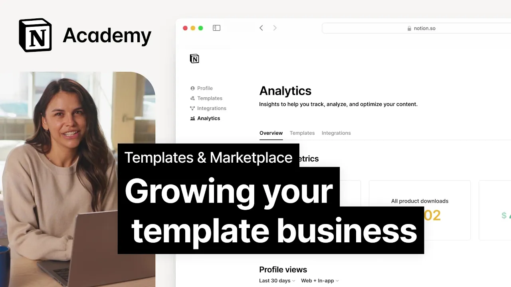

# Growing your template business with Notion Marketplace

**URL:** [https://www.youtube.com/watch?v=sM11YYzm2X4](https://www.youtube.com/watch?v=sM11YYzm2X4)
**Date:** 2024-10-29

## Transcript

**[Voiceover]**

"[Music] throughout this course we've covered the basic elements of template creation from coming up with an idea for a template to building a great Creator profile and even establishing a marketing funnel as you get up and running with templates there's an endless list of ways to grow and improve in this video we'll hit on three tools that can"

"help you grow your template business over time here we'll look at email reviews and analytics let's take a closer look at each of these starting with email when you make your Crea a profile you'll have the option to collect email addresses from users who duplicate your template we found that the most successful templates come with more than just"

"the digital product and these additional benefits are often delivered through email and while you need to set up your own email platform in order to actually use these emails it's an important first step in starting to build a community to send updates keep in touch with buyers and even Provide support to users that gets people on my email"

"list um something that I think is classy to do is to allow people to download those free things without requiring them to get on a marketing newsletter so I basically go hey you can get on my newsletter and get the template or you can skip the newsletter just get the template I'm cool with both and then uh when"

"people actually do get in our email list I do send them a couple of autoresponders first one is some more free resources I want to give people quick wins and then I think the second one we do is a hey if you are looking for an all-in-one productivity system you want all these systems to mesh together we've built"

"that with ultimate brain you can buy it here's a quick discount code for being a subscriber um and that's basically basally it nothing super fancy no webinars no 20we long autoresponders just hey here's the solutions we have for you next up reviews users can rate and review your templates this is a great way to get feedback on what's"

"working well and what could be improved pay attention to both the positive and negative reviews use your good ones to promote your work and learn from the constructive criticism to make your templates even better it's all about constantly improving to meet your users's needs sometimes they make me really happy when oh this is so good it's awesome thank"

"you sometimes oh no this this is Laing this or that and I learned that this kind of feedback is really good because then you can improve the product so for me having feedback is is always good even if I don't like it you can also respond to reviews to highlight bugs you fix since receiving the feedback or just"

"to thank people for their time finally analytics remember that marketing funnel analytics can help you understand where your users are dropping off in your funnel lots of views with a small number of downloads might mean that while you're reaching lots of users with your marketing your product isn't hitting the mark on the other hand a high view to"

"download ratio might mean you have an opportunity to cast a wider net and reach more people analytics in a Marketplace are really essential because it allows you to get feedback essentially on what you've published and how you're publishing and who you're reaching with it so what I like about it in the current systems that I use is I"

"can see on certain products if there's a higher percentage of people that have clicked and then downloaded or purchased and on other products if they haven't so it allows you to actually iteratively improve the information that you're sharing with customers for someone whose business is based on a relationship with a customer that you don't actually meet the Analytics"

"mean that you're able to hone what you're doing so I have massively found that that this has been brilliant for my bigger templates where you can improve the text and the kind of explanation of something that's quite big and it means that you go okay the percentage of people actually downloading has gone up that's a better landing page"

"and therefore it's doing a better job so yeah it's going to be really helpful to understand how your business is doing basically in improve it at the end of the day no one knows this work better than creators themselves so I'll close out our course by handing it off to our top creators to share their tips and tricks"

"that help them succeed in creating notion templates see you online so top tips for new new template creators would be keep it simple and make sure that you are creating something that solves a real world problem for someone else that might be entertainment it might be learning it might be to solve a kind of an issue with managing"

"your tasks or your projects or whatever but make sure it soles a problem and that it works for you and then it will probably work for everyone else I would also say don't imitate but you can definitely learn from other people so I think it's fine to go oh someone else has done this and then think about how"

"would I do it and what would I want it to be so I think if you make stuff that really helps you you're inevitably going to help other people as well you need to somehow stand out trying to find your own Vibe so people when see something ah I I think this is frona or any other Creator so"

"I think branding also it is important to have your own vibe to your own Styles but is not trying to make it stand out just because you need to feel comfortable with it otherwise it's not sustainable so you need to find your own way to do things stick to it so people will recognize you as a something that"

"they can trust because you are doing things in the same way getting started with a my uh my YouTube channel uh creating my audience on social media so I was sharing templates and uh people enjoyed it people enjoyed uh like seeing uh me building templates but also to showcasing stuff that I did so that really helped me uh"

"on my content site and for my network uh like I'm also a consultant uh I'm a solution partner I think that's how we are called now that helps me a lot because people get to discover me through the templates and they see wow we can do great structures in no and some stuff that are useful and beautiful and"

"easy and they're just like can you build my custom machine workpace like that and I get also a lot of opportunities from the templates on my consultant uh job you should try it start from something really simple don't what I started my way of learning is just by doing I would if I'm just looking at things and don't"

"try it is not really possible for me and I think notion is a really handsome platform so you should try but you start really simple you don't need to create really complicated templates with massive databases and relations and automations you can do that if you want a little bit later the marketplace is a great place to start because"

"everything is done for you things it you just have to upload your template sets the product page and that's it so that's very easy for uh new creators too other than that go for it try it because you never know who needs what you're thinking about or what you've gone ahead and created for yourself"

