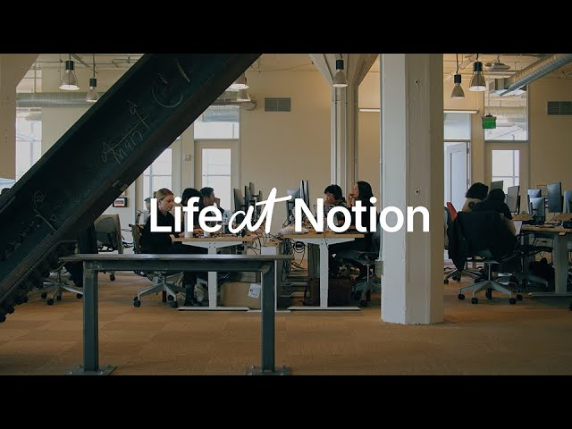

# Life at Notion - How we work

**URL:** [https://www.youtube.com/watch?v=JiSQTMmGHFI](https://www.youtube.com/watch?v=JiSQTMmGHFI)
**Date:** 2024-11-20

## Transcript

**[Voiceover]**

"[Music] notion is made up of three main organizations first is epd which is engineering product and design then go to market which is our sales and marketing organization and then lastly foundation and Foundation is a mixture of people finance and legal the way engineering product design Works in notion is that it's very atypical in that there's no CEO"

"among the three it's truly a jazz band coming together where in many cases Engineers are making product decisions and product people are something making technical decisions and the designers are in the mix trying to really sort of build it together I've been very fortunate to work in tech for the last 20 plus years and this is the fastest"

"I've seen any engineering team work and moveed a word that often comes to mind is rigor a lot of thought has been put into how the pieces of the product fit together that ethos is very much present in the entire epd organization [Music] as a go to market team our job is to understand what are the problems that"

"our customers are facing we help support customers as they're learning about notion for the first time as they need help across their Journey where they're from the go to market organization So within the foundation Department there are three orgs so we have Finance legal and the people Org the focus of the people team across the company is to"

"look after our employees and we're really thoughtful about everything that we do they're still pretty early days and building out a lot of the processes to support a company that's growing this rapidly which I think gives a lot of opportunity for people to grow each person at notion really cares about the craft of the product craft is something"

"I really learned about from our founder Ivan who is really fastidious when it comes to ensuring that everybody who works in oce is either a master of or is becoming a master of their craft that's certainly what I strive for with my team and I think that you can find that all around notion the craft of building a"

"company is a group of people working on something meaningful and when they look back let's say 10 20 30 years they say they did the best work in their life there and they couldn't have done anywhere else"

