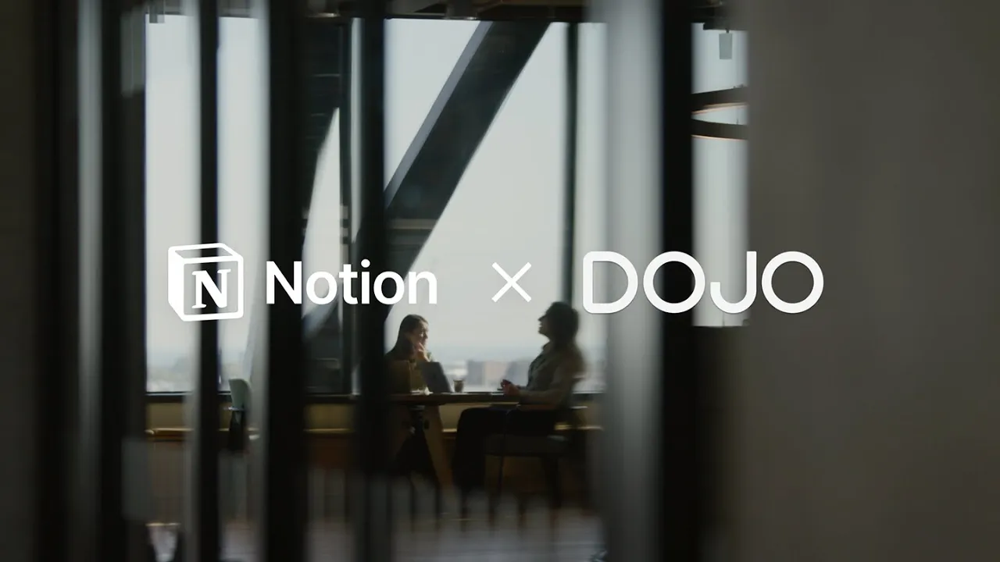

# How Dojo consolidated dozens of tools with Notion for a new way of working

**URL:** [https://www.youtube.com/watch?v=yd5a6h2bsGk](https://www.youtube.com/watch?v=yd5a6h2bsGk)
**Date:** 2024-12-11

## Transcript

**[Voiceover]**

"[Music] Dojo is a payments F tech company we provide Payment Processing services to businesses across the UK and also several markets in Europe the culture at Dojo is very much work hard play hard we work with super hardworking really talented people but we also like to have fun when we do it as well when I started at dojo"

"there were only 400 employees and now we've got over 1,200 employees which is super exciting but that kind of growth also comes with challenges one of the biggest challenges that we face at Dojo is we're always trying to get a lot of stuff done at the same time and making sure that we're working on many different company priorities"

"all at once as we got larger and larger we found that we had a absolutely huge amount of tools and everyone was using different Tools in different ways and it just became really inefficient both from a financial perspective but also from a ways of working in time perspective as well and that was one of the main reasons we"

"really started to look at notion for a solution the main way that notion has transformed our approach to knowledge sharing is having everything in one place so whether that's how we document whether that's how we project manage whether that's how we manage things like budgets everything is now in one place it makes it so much more efficient and"

"so much quicker and easier to work together if we're able to collaborate better together and break down the silos in the way that we work then we're delivering the best possible outcomes for our customers at the end of the day the thing that surprised me most about using notion is how easily we manag to get people on board"

"with it the power of choosing it for the company at being that one Central space and actually to bring everybody on that journey into one place has been really valuable the entirety of our business is using the tool day in day out and for anyone who has worked at a startup or a scale up will know that we"

"move quite fast and we like to change things but notion has really stuck notion does so much more than it just kind of being a Wiki I think it can help solve multiple problems for fast growing companies that time that we before spent searching for things we can instead spend doing really valuable work like building amazing products for"

"our customers we all know the one central place where everything is stored and that place that you can go to is notion [Music]"

