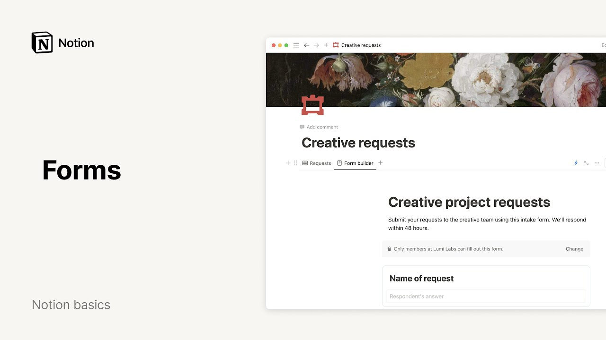

# Creating Forms

**URL:** [https://www.youtube.com/watch?v=h4SZQvX2hUU](https://www.youtube.com/watch?v=h4SZQvX2hUU)
**Date:** 2025-01-14

## Transcript

**[Voiceover]**

"whether you're collecting RSVPs or bug requests forms make it easy to gather information take action and move your work forward without ever leaving your notion workspace fors can be created in two ways to create a form from scratch navigate to a new page and select the form option this will bring up a form Builder that you can customize"

"to fit your needs another way to create a form is from an existing database view simply click the plus sign next to your database views and select form from the dropdown menu you'll then be presented with the option to either create a form from scratch or create one using existing properties existing or pre-selected properties automatically convert your database"

"column titles into form questions this means you don't have to type out each question manually and don't worry you can always add more questions later if you need to for our example let's create an intake form for a creative requests database using existing properties start by giving your form a clear title and description for example let's name this"

"intake form creative project requests you can also add a brief note about your team in the description section this helps people understand the form's purpose and relevance since we we used pre-selected properties your form questions are already listed you can tidy them up and then customize your question format to do this click the three dot menu icon next"

"to any question you'll see a list of question options to choose from here you'll be able to fine-tune how your questions appear you can choose from a variety of question types including text multiple choice date and time options person files media and much more for our first question let's use the multiple choice option to limit users to one"

"choice will'll set the maximum selection to one for the next question let's add a way for people to upload visual mockups this can help explain their ideas better first title your question attach mockups then set the question type to files and media this allows users to upload images or other files directly through the form consider adding a description"

"to this question to help users understand which types of images and media files work best let's add a few final touches like marking all the questions as required so that we don't miss any information and double checking to make sure the questions are linked to the right property in your database keep keep in mind that if the sync"

"with property name option is enabled any changes you make to your question title will automatically change the linked column name too if you want to change these names separately you can turn off the sync feature great you're all set to share your form sharing a form is easy and just takes a few clicks the best part you can"

"share your form both internally and externally this means anyone can fill out your form even if they don't have a ocean account to share your form click the blue share form button in the top right corner of the form Builder from there you can choose to share it with your workspace members create a public link or close the"

"form entirely you can also set your form to accept Anonymous responses to set this up simply turn on the anonymous responses option in your form share settings but for our current example we probably don't need this feature now that your form is up and running let's dive into the data you've collected forms responses show up as rows in"

"your database a great way to make sense of your data is by adding additional views to your database like a chart you can create one right here in notion to add a chart click the plus sign in your database views and select chart as the view type for more customization options click the three dot icon near the top"

"right of your database this menu allows you to fully tailor the appearance and functionality of your chart with your chart in place you'll quickly spot which creative services are most requested and how the overall responses are distributed forms and notion do more than collect answers after you get responses you can set up automations to help you use the"

"information you've collected quickly and easily for example you can set up automated notifications through slack or email connected to your form let's say you want to notify Emma your social media manager whenever someone submits a request for a social media post to set up this automation navigate to the top right corner of your database and click the lightning"

"bolt icon in your new automation add your first trigger and its corresponding action in the trigger section select social media under the type of request property then in the do section set your action to send mail 2 add Emma's email address to the two section using Advanced formulas you can get creative with the subject and body of your"

"email for instance you can set the formula to automatically include the requester's name for each new request in this case it would be page creator just make sure to save your work when you're satisfied with the fields click create taada your new automation is ready to roll notion has so many automations to choose from so play around with"

"different setups and see what clicks for you there you have it you now have the tools to transform how you gather information from creating custom questions to automating tasks with forms happy building [Music]"

