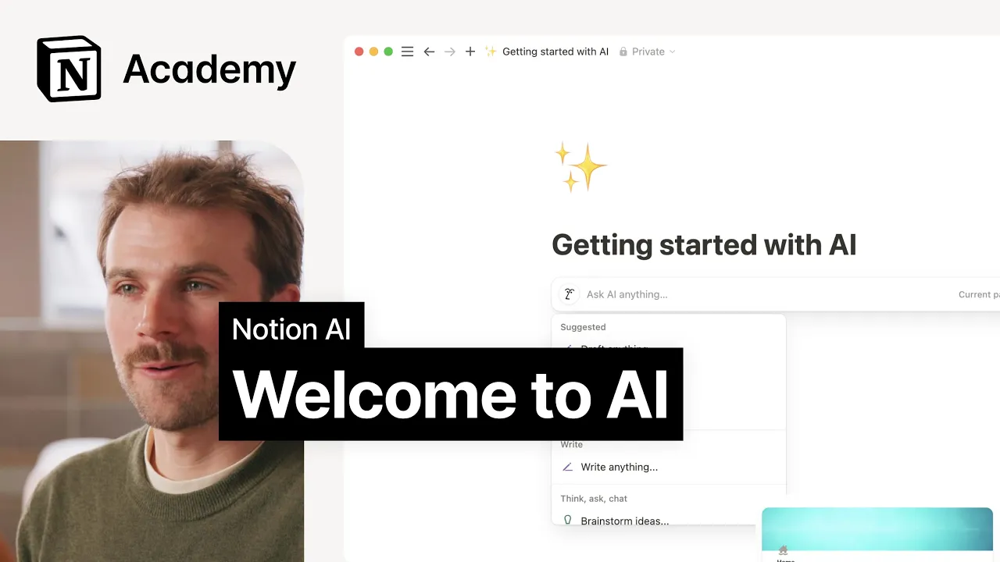

# Getting started with Notion AI

**URL:** [https://www.youtube.com/watch?v=Y5FvtQomPh8](https://www.youtube.com/watch?v=Y5FvtQomPh8)
**Date:** 2025-03-17

## Transcript

**[Voiceover]**

"hello and welcome to our course that's all about getting started with notion AI whether you're using it for the first time or looking for new tips and tricks you're in the right place my name is Johnny and I'm on the marketing team at notion I've been working with AI for the past few years learning how and where it's"

"most helpful in Daily work these days it feels like AI comes up in so many conversations and while 87% of Executives agree that humans who use AI will have an edge in the work force most teams admit they don't feel like they're using it to its full potential so after years of AI hype if you're still wondering how"

"to make it genuinely helpful in your day-to-day work stay tuned in this course we'll get to know notion AI what it's great at what it's not so great at when to use it and when not to we'll cover its superpowers like helping you find answers writing like a pro and automating common tasks we'll end by exploring how you"

"can help facilitate better AI use on your team for a more productive organization overall our goal is to go beyond quick tips to help you gain a deep understanding of this powerful technology so before we get into all that what is notion AI at its core notion AI brings together the capabilities of today's leading AI tools it can"

"chat write search edit analyze and more serving as your helpful assistant to support your work whenever and wherever you need it our AI tool is powered by the latest versions of popular large language models so you can ask it about anything in the world but unlike those AI tools it knows you and your work notion AI can tap"

"into knowledge in your workspace and in other apps you use at work making it a much smarter alternative to your average text generation tool or chat bot and since it knows you it can answer all of your work questions too like whether I remember to tell my manager I'd be filming this [Music] today also don't worry by default"

"notion and its AI providers do not use your personal data to train their models plus when you ask a question your answers only include information you already have access to soon we'll get into examples of when and where to use AI to find information write and edit docs and so much more but first I wanted to ground Us"

"in some guiding principles at notion we hold the belief that AI is a tool used to augment human intellect not replace it with that in mind there are broad categories where AI outputs can stand alone and sometimes where they shouldn't one framework we love explains AI usefulness with just two questions how certain am I that AI can produce"

"a highquality response to this prompt and how high is the risk if it doesn't by answering these two questions you can decide how to use AI when the certainty is high and the risk is low like summarizing a document AI is a great option to help move your work forward with little to no human intervention on the other"

"hand when the certainty is low and the risk is high like making decisions AI is better used as a thought partner to help you look at problems from lots of different angles one last thing before we move on how do you actually access notion AI like all the best assistants notion AI is right where you need it integrated"

"into your workflow when you're writing on a new line just click space to pull it up similarly if you're stuck on a word or sentence you'll find the AI face in the formatting toolbar ready to help for meteor questions and research access notion AI in the bottom right hand corner of any page or open it into its own"

"full page experience if you're ever on mobile the face icon will get you quick answers to questions on the go all right that's enough for now hopefully you have a better understanding of what notion AI is and how it works in the lessons that follow we'll get to know its capabilities at a deeper level so that you can"

"become the AI Pro you want to be see you soon [Music]"

