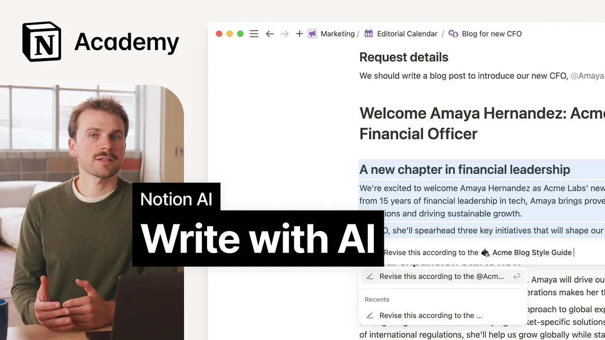

# Writing with Notion AI

**URL:** [https://www.youtube.com/watch?v=hDF8gKDOSYU](https://www.youtube.com/watch?v=hDF8gKDOSYU)
**Date:** 2025-03-18

## Transcript

**[Voiceover]**

"[Music] in this lesson we'll explore how notion AI can support in the writing process from aiding your research to creating an outline transforming notes into a workable first draft and more if you've played with AI tools at all you have probably tried asking for a draft of an email silly story or poem while these results are almost always"

"entertaining their usefulness is often limited but that doesn't mean there isn't room for AI and high quality writing the key to writing with AI is understanding when and how to pull it into your writing process bear with me as we quickly revisit the seventh grade to recall the five steps of the writing process research creating an outline writing"

"a first draft making improvements and polishing the final version you wouldn't create a draft without researching and outlining and you shouldn't expect AI to do the same like many other components of work AI can speed up each step in the writing process so long as you know what to ask for let's dive into the example of writing a"

"blog post perhaps you're working out of your company's content calendar and starting work on a request to announce your company's newest executive hire before you take pen to paper or fingers to keyboard you probably need to do some research who's this hire and why are they here what's the story AI search can be a handy tool to help"

"you quickly gather context from around the org and get the wheels spinning for example try using the corner chat to ask AI who is Amaya Hernandez you'll get quick search results from your notion workspace internal presentations meeting notes and more to help guide your thoughts from here you can click into the sources to start learning about each one"

"even taking notes on your own once you're feeling good it's time to outline here you might try asking notion AI to create a template for a particular type of Doc like so or better yet ask it to arrange your notes based on an existing template in your workspace to do so simply select your notes and ask notion AI"

"to create an outline based on an existing page in your workspace just be sure to act mention the other pages so notion AI can keep it top of Mind nice now it's finally time for a first pass at the draft you can use AI in your docs for quick text generation just ask notion I to generate a draft"

"it will consider the context of the whole page to give you a smart output but better yet try taking it in smaller chunks select some bullet points and ask AI to write a paragraph with specific goals in mind based on the contents of those bullet points continue refining with AI at your side until you're happy with your draft"

"okay everything is looking good but wait you totally forgot your new company has a specific style guide for blog posts no worries you can select your entire document and ask AI to rewrite your doc with the style guide in mind again all you need to do is select your text and at mention the style guide in your prompt"

"perfect at this point you'd probably want to give the whole thing a read through to ensure it meets your standards as you do so notion AI has a suite of writing tools ready to support just select text and use any of the prepackaged skills to check your spelling and grammar prove writing change the length of a piece of"

"text and more you can even ask for synonyms or alternative phrasing with free prompting and then favorite those prompts for later use when you're done you can generate translations in a few clicks for your Global teams and customers looking great one last thing to cover before we move on throughout this example you may have noticed we referenced a"

"number of pre-created pages in our prompts these can be a really useful tool for quickly adding instruction to your prompts by at mentioning Pages you give notion AI direct access to the knowledge context and even formatting contained in those pages allowing it to better understand just about anything when it comes to writing more efficiently you may consider creating"

"a style guide including Channel specific content guidelines document templates formatted tables or lists or any other number of pages to support and expand notion ai's capabilities that's it for this lesson by thoughtfully incorporating AI I at each stage of the writing process we created higher quality content more efficiently instead of trying to generate entire drafts with a single"

"perfect prompt we've seen how breaking the process into research outlining Drafting and editing lets us harness AI strengths while maintaining creative control and by using pre-created style guides and outlines we can customize AI outputs to match our needs even more precisely happy drafting [Music]"

