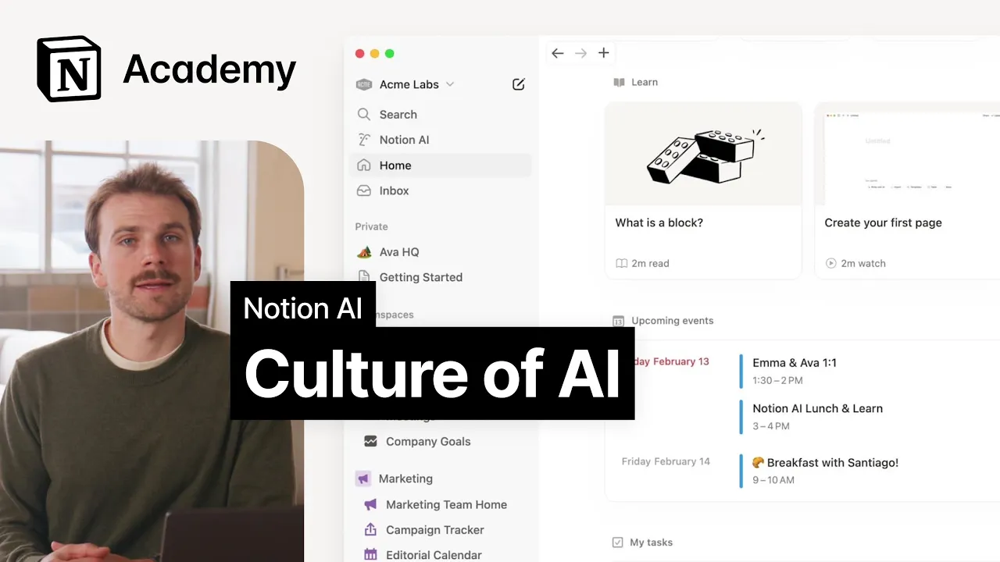

# How to build an AI-driven culture at work

**URL:** [https://www.youtube.com/watch?v=wHVsycOJejs](https://www.youtube.com/watch?v=wHVsycOJejs)
**Date:** 2025-03-18

## Transcript

**[Voiceover]**

"[Music] we're nearing the end of our time together hopefully in this course you've been able to identify at least a few ways to use AI in your day-to-day work whether that's finding information writing better or working through projects more efficiently and while those individual productivity gains are valuable we've found that the real power of AI emerges when entire"

"teams embrace it as part of their workflow when this happens work becomes more efficient as a result your team can ship faster and focus on whatever it is that matters most to you and your customers in this lesson we'll cover ways to bake AI into your company processes and recommend tips for establishing a culture that creates space for"

"AI powered Solutions over the past few years we've found that teams who get the most out of notion AI Implement strategies across three main categories the first is internal product decisions to encourage the use of AI the second is a culture of documentation across the organization and the third and final one is continuous advocacy and use case-based internal"

"education internal product decisions involve strategically embedding AI features and prompts within templates and workflows in notion to make AI usage a natural part of daily work for example you might add an AI property in a meeting note database to generate a summary or another to capture action items automatically similarly you might strategically place encouragements for teammates to ask"

"AI for support in a project update template or AI blocks inside database templates to create quick summaries next there's cultivating a culture of documentation this means creating an environment where team members consistently record and share knowledge making it accessible for both humans and AI to leverage we contrast this to a culture of asking which relies on communal knowledge"

"and interrupting colleagues for information meanwhile a culture of documentation ensures knowled is accessible and searchable at any time for more guidance on building a strong documentation culture in your organization check out our lesson on creating a culture of documentation you'll find there's benefits going Way Beyond AI efficiency finally there's continuous advocacy and education this involves regular training knowledge"

"sharing and championing of AI use cases to maintain momentum and increase adoption across the organization for example teams might hold monthly AI showcases where employees demonstrate creative ways they've used AI to solve problems or maintain a dedicated slack channel for sharing AI tips and success stories these advocacy efforts work because they make AI adoption feel more approachable since"

"AI offers a wide range of capabilities seeing concrete examples from colleagues makes it easier to understand and Implement effectively let's break this down by following how a cooworker might get introduced to notion AI First Imagine This coworker starts her day by adding updates to a standup agenda a few product decisions made by the architect of this database template"

"support her AI learning right off the bat she sees the familiar AI summary at the top of the meeting note next she sees a suggestion baked into the template to ask AI for her status update interesting this leads her to ask AI for a quick update now in many workplaces asking notion AI for an update on what you're"

"working on would yield little results for this to actually be helpful it requires that the company has a culture of documentation where project docs and status updates are stored and written down luckily in this organization with a robust culture of documentation our coworker is able to find updates across notion slack as well as GitHub and jira for her"

"engineering work with that to-do item checked off her list our new friend revisits her calendar here she sees an invitation to a lunch and learn about noce AI lunch and learn sessions helps spread AI knowledge throughout the organization experienced users that's you demonstrate practical applications that feel useful making AI more approachable for everyone these sessions let team members"

"share success stories and challenges they can also help to address key concerns about AI like data privacy and responsible use policies within a specific organization remember transformation doesn't happen overnight start small focus on wins that matter to your team and gradually expand your AI use as your organization grows more comfortable with these tools the key to success is"

"making both Ai and documentation feel like natural parts of how work gets done rather than extra tasks to complete when done right team members will wonder how they ever worked without this powerful combination now it's your turn to take these insights and start building an AI driven culture in your organization have fun [Music]"

