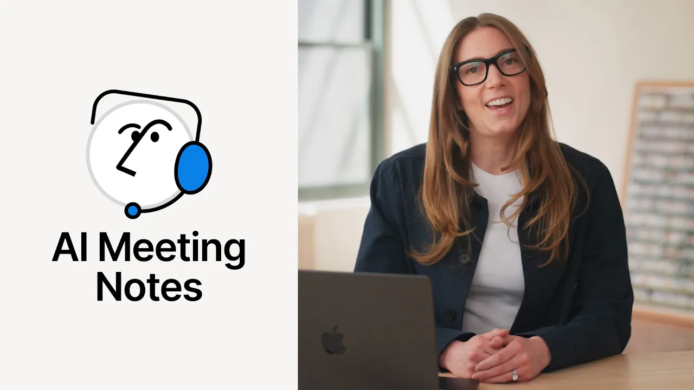

# Introducing AI Meeting Notes

**URL:** [https://www.youtube.com/watch?v=f4ZYEZO3Sq0](https://www.youtube.com/watch?v=f4ZYEZO3Sq0)
**Date:** 2025-05-13

## Transcript

**[Voiceover]**

"Hi, I'm Julia here to show you how to upgrade your meetings with AI meeting notes. Before your notes lived everywhere in notebooks, in separate transcription tools, or just in your mind. Now, meeting notes always live in one place, Notion. With AI meeting notes, conversations are transcribed and summarized automatically. Let me show you how it works. You can start"

"meeting notes from Notion Calendar or by typing /me on any page. No separate app needed. It works directly with your favorite conferencing tools. Just click start and focus on the conversation while notion AI transcribes. During the meeting, teammates can jot down important thoughts in the notes tab. When the meeting ends, Notion AI combines everything into an organized summary"

"and action items. AI can help with drafting post meeting comms like summaries or project status updates, whatever you need to keep your team informed. Now all meetings are captured and searchable in one place. No more lost ideas or forgotten decisions. With AI meeting notes, everyone can focus on the conversation while AI takes care of the rest. Try it"

"in your next meeting and see how effortless notetaking can be. [Music]"

