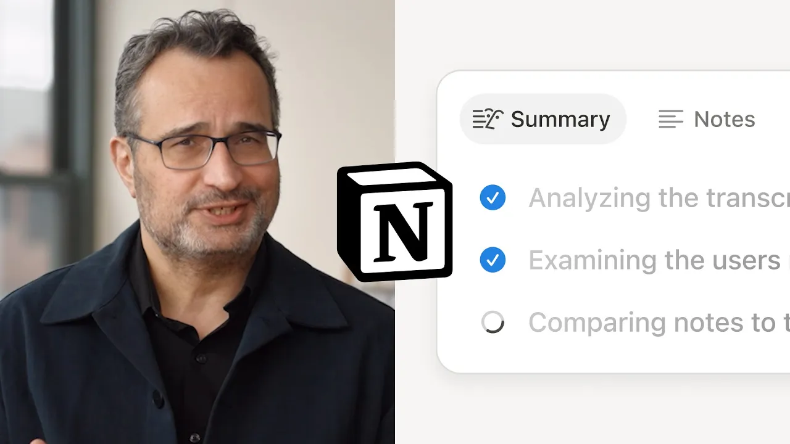

# How our CTO uses Notion AI for work

**URL:** [https://www.youtube.com/watch?v=gOfjC4WIPo0](https://www.youtube.com/watch?v=gOfjC4WIPo0)
**Date:** 2025-05-13

## Transcript

**[Voiceover]**

"This is Fuzzy. Take one mark. Hi. I'm Fuzzy and I support the engineering teams here at Notion. And if you're a team working in Notion, today's a good day, because I'm here to introduce a brand new toolkit of AI capabilities designed for work. Your workspace now has Enterprise Search, AI Meeting Notes, Research Mode, and unlimited use of your"

"favorite AI models. Let me show you how it works. First, let's start with search so I can get caught up on all the latest before I head into a meeting. Of course, I can search by keyword here, but I can also ask and open ended question. Notion immediately searches across all my tools like these pull requests from GitHub"

"or these conversations happening in Slack. And I even get a quick AI summary. Enterprise Search supports a growing list of your team's most important tools to find exactly what you're looking for. It even searches across all the PDFs you've uploaded to your Notion workspace. So now that I'm up to speed, I'm ready for our weekly meeting with the"

"product team, which is about to start in a minute. So I'll pop open our meeting notes doc here, and you'll notice a brand new type of block at the top AI Meeting Notes. It perfectly transcribes the entire meeting so everyone can be fully present, and I can be assured that every discussion gets automatically cataloged for future reference. When"

"the meeting's over, I get the super organized summary way better than notes I would have taken. And it looks like we have some next steps here. Now, normally I would send a few Slack messages to engineering and product and sort through way too many browser tabs to find what I'm looking for, but instead I just head over to"

"home and there's a new option here for Research Mode. So let's ask it to put together a report. You can see how Notion AI approaches my question more thoughtfully here. It reasons with itself and spends more time searching for the highest quality info. And now we have a detailed report that we can easily share with the team. I'm"

"not joking when I say this is something that would have taken me a week to put together. Now all that's left is to celebrate the team's work. So let's ask for some help. Back on my homepage, you'll see we added the ability to chat directly with the latest models of OpenAI and Anthropic. Perfect for a quick brainstorm. This"

"new set of tools is not a separate app or a browser tab. It all lives directly in your Notion workspace, reducing software sprawl and saving your team money. That's why we decided to include the entire suite of Notion AI features in our new Business and Enterprise Plans. All with the enterprise grade security and controls you'd expect from Notion,"

"along with our promise that your data won't be used to train any AI models. Many of our customers are already seeing incredible results when they consolidate their teams and processes in a single AI workspace. That's all for me. It's time to build."

