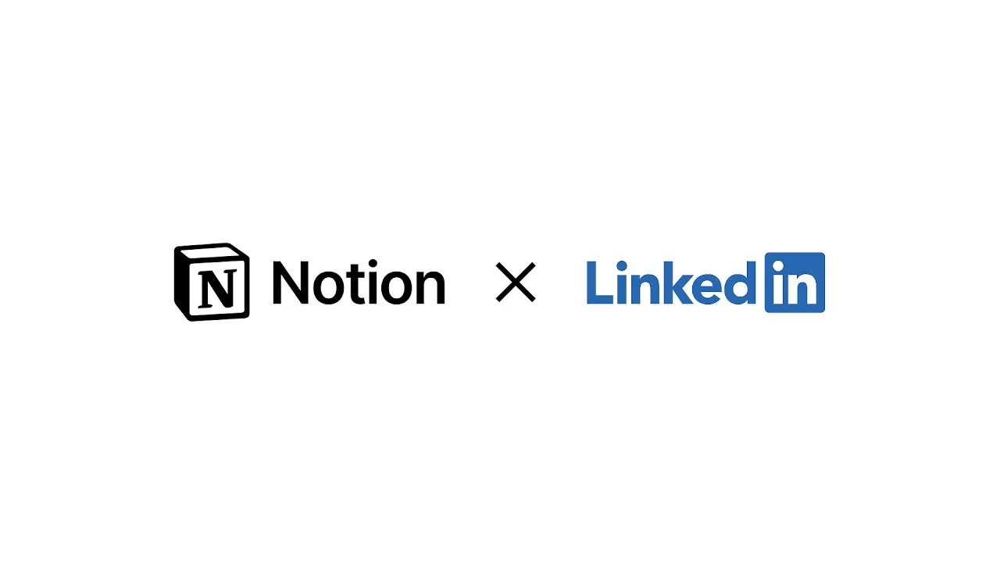

# Notion x LinkedIn

**URL:** [https://www.youtube.com/watch?v=n2mBSWjcKbQ](https://www.youtube.com/watch?v=n2mBSWjcKbQ)
**Date:** 2025-07-16

## Transcript

**[Voiceover]**

"Hello. I'm Akshay Kothari, one of the co-founders of Notion, and I'm here today at the LinkedIn headquarters to share something really exciting. But before I do that, a quick backstory. I used to work here! I used to come here in this building for many years, and I’m going to reconnect with my old boss, Ryan Roslansky who’s the CEO"

"of LinkedIn. Let's go in. Akshay, it's great to see, man! Welcome back to LinkedIn! Great to see you. So what brings you by today? Well, some exciting news... I guess we're bringing the band back together. We have something really exciting to launch. Do you wanna talk a little bit about it? Sure, so... LinkedIn Premium members are, getting access"

"now to a six month free trial of Notion AI which is really cool. But really excited to now see what job seekers can do with Notion AI. You're one of the greatest product people I know. So maybe thinking about it from a job seeker’s perspective, like if you were a job seeker, how would you use Notion AI right"

"now? Well, we've actually seen a lot of people really use Notion databases as a way to track their applications, track the companies that they want to talk to. They can also now use AI to research about these companies, about these roles, what they're applying to, and how they can prepare themselves for for these interviews coming up. Even beyond"

"maybe a job seeker... If I was, even like a small business owner, are there use cases there as well? These are like two really popular use cases from our Premium members right now — small business owners and job seekers. So for a small business, what would you do? A lot of small businesses really think of Notion as their"

"second brain. It's their operating system. You know, for these small businesses, Notion can really be the all-in-one workspace. And you can do everything from keeping all your docs in one place to managing your projects. And, and I think the connectivity for them between all the people they work with is really, really strong. So I'm really excited for our"

"all the LinkedIn Premium members to get this access for six months. Awesome. So if you're LinkedIn Premium member, super easy — we’ll send a link in the comments below, you can go check it out and try out Notion AI for the next six months. Thanks, Akshay! Good to see you again, man. Great to see you. Like, this makes"

"a ton of sense, actually. It does. Oh my gosh."

