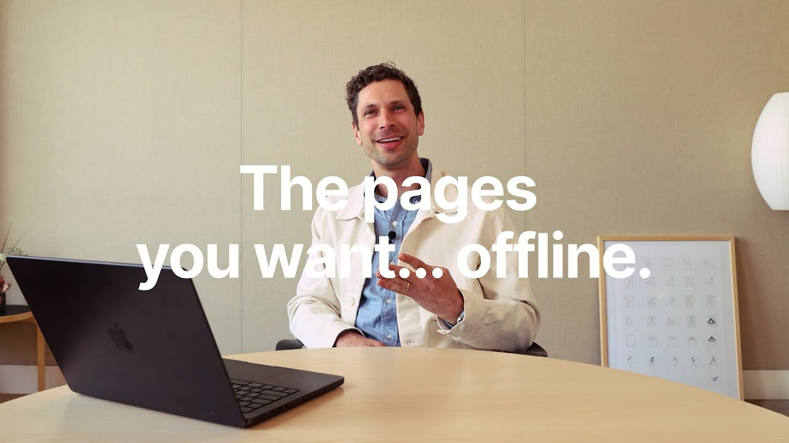

# Offline mode (with Austin)

**URL:** [https://www.youtube.com/watch?v=BltbbJFHoGc](https://www.youtube.com/watch?v=BltbbJFHoGc)
**Date:** 2025-08-20

## Transcript

**[Voiceover]**

"Five words or less. What is offline mode? &gt;&gt; Uh the pages you want offline. Hey, I'm Austin. I'm an engineer that worked on offline. So in the top right in the three dot menu, there's a new action called available offline. This is available in our desktop app and our mobile apps. So you just flip this switch on and"

"it'll download it. And then if you go over to the settings page, there's a new panel called offline. And so for users that are on our plus business or enterprise plans, we'll automatically make your recents and favorites available for offline. And here you can see which pages uh you've manually marked. So see here's that company homepage that we"

"just marked. And then there's also this downloaded by notion tab. So you can see the pages that we're automatically downloading in the background for you. &gt;&gt; So what's your favorite part of this and how it works? &gt;&gt; Yeah, I love how databases work. When you mark a page available offline, we automatically download the first 50 pages of that"

"database for you. So I have a links database where I save a lot of articles with a notion web clipper and when I save an article to that database, it's automatically downloaded for me. That means when I go on a plane, I can read all of my recent articles just, you know, offline automatically. So this is really just"

"the first step. The the team is still working on all types of things related to offline mode, but we're really excited for you to try it out. Uh so let us know what you want us to build next. [Music]"

