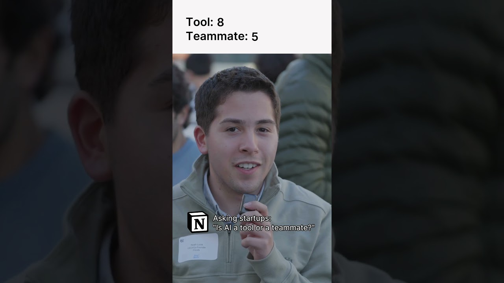

# AI: Teammate or Tool? #notion

**URL:** [https://www.youtube.com/watch?v=98blrJ07J-o](https://www.youtube.com/watch?v=98blrJ07J-o)
**Date:** 2025-08-22

## Transcript

**[Voiceover]**

"It's a teammate. AI may actually have feelings. &gt;&gt; I think it's a tool. I feel like AI is tools to an end. &gt;&gt; A tool &gt;&gt; for personal usage. A teammate. For professional usage, it more like a tool. &gt;&gt; Recently, as a teammate, &gt;&gt; I definitely think teammate. You have to show it love. You have to tell it"

"good job when it does something well. &gt;&gt; A tool. &gt;&gt; I think I see AI as a teammate more than a tool. &gt;&gt; A tool, but it's like a becoming like a teammate. &gt;&gt; AI is definitely a tool. Uh, it's starting to become a teammate. I think right now it's a tool, but I think it's changing to a"

"teammate pretty pretty quickly. &gt;&gt; AI for us is a tool and for the startup that I'm doing, uh, &gt;&gt; uh, it's more of a teammate. Uh, it's really in between, but it's more of a teammate for us. &gt;&gt; A tool. &gt;&gt; When I'm coding, especially when I use things like cursor, it's very much a teammate. &gt;&gt; Right now,"

"it's a tool, but I would love for it to feel more like a teammate. &gt;&gt; It is a teammate for me. Like, it is actually an intern. When done right, it can really augment you much better than what the current generation of tools can."

