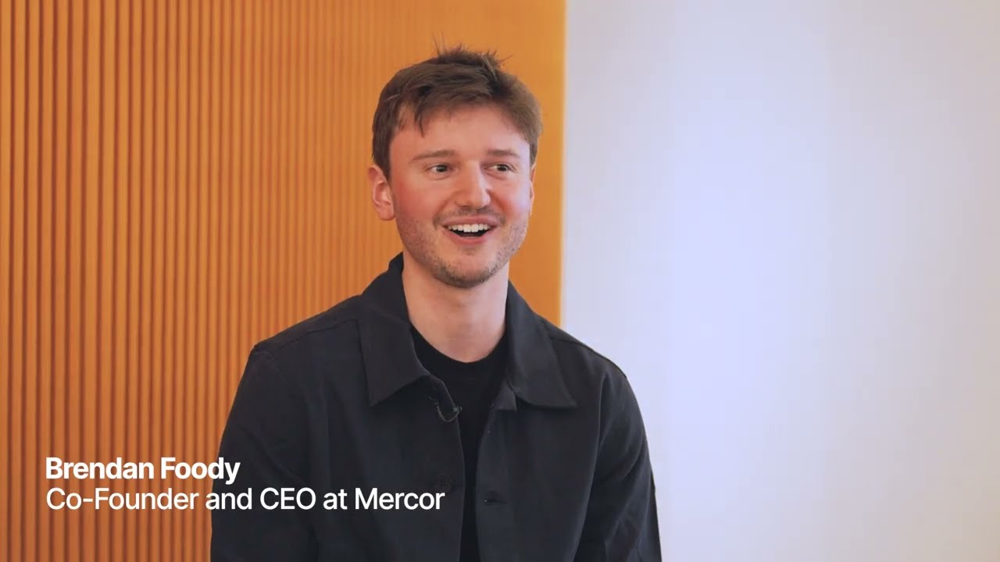

# First Block: Rewriting startup playbooks with founders of Mercor, Cursor, and Clay

**URL:** [https://www.youtube.com/watch?v=jAxFaZFzb00](https://www.youtube.com/watch?v=jAxFaZFzb00)
**Date:** 2025-09-11

## Transcript

**[Voiceover]**

"[Music] A lot of people treat fundraising as like an outcome and that's totally wrong. We obsess over the first 10 people we hired. We hired very slowly and I think all of them were crucial to our success. We went from it taking like seven demos for someone to buy a 200 a month product to over the course of"

"9 to 12 months like no demos. Actually, now is the most exciting time in history to build a company. Like the difference between what's possible with AI and what's been actualized in the economy is so large. There's so much to do. One place where we broke things is uh we started as a solution in search of a problem,"

"which is not really something you're supposed to do when you're starting a company. [Music]"

