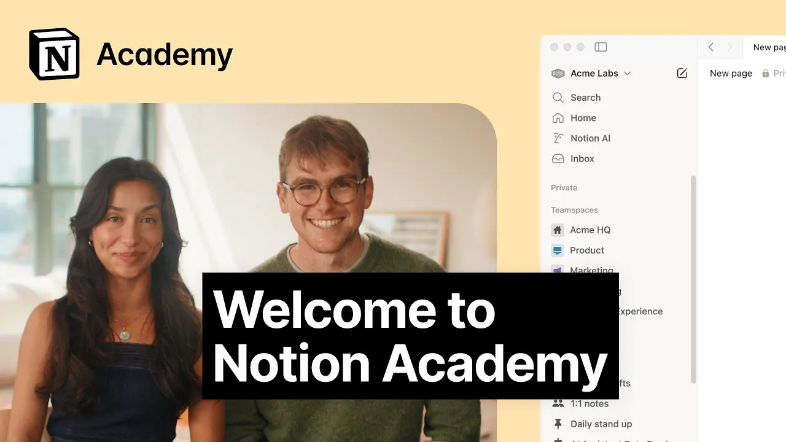

# Welcome to Notion Academy

**URL:** [https://www.youtube.com/watch?v=xj4gX7PS918](https://www.youtube.com/watch?v=xj4gX7PS918)
**Date:** 2025-09-18

## Transcript

**[Voiceover]**

"This is nursing academy. &gt;&gt; Here you can go from beginner to expert with our three paths &gt;&gt; and take an exam to get notion certified. &gt;&gt; You'll learn building with blocks, databases, sharing and publishing, automations, relations and roll-ups, notion AI, and more. &gt;&gt; Let's walk through how to build a connected knowledge system that grows with your team &gt;&gt;"

"by connecting things in ways that separate apps never could. &gt;&gt; This flexible block-based approach lets you build exactly what your team needs. No code required. From your very first page to building advanced workflows, Notion Academy is the place to level up. Learn as you go, pick up new skills, and get certified today."

