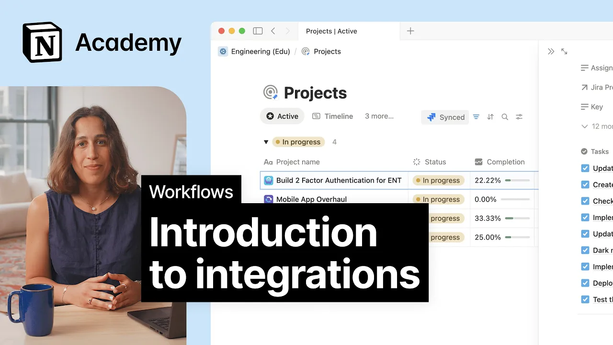

# Introduction to integrations

**URL:** [https://www.youtube.com/watch?v=KMfJV5GyCEw](https://www.youtube.com/watch?v=KMfJV5GyCEw)
**Date:** 2025-09-18

## Transcript

**[Voiceover]**

"[Music] Integrations in Notion connect your workspace to the external tools your team already uses like GitHub, Jira, Figma, and many others. So you can sync data, automate workflows, and reduce manual effort. When you're working with projects and tasks, these integrations make it easy to pull in issues, tasks, or tickets from other platforms, creating a single source of truth."

"[Music] Connected properties are a special kind of database property that link to third party tools like GitHub, Figma, Zenesk, or Google Drive. And because they're built right into your database, they go way beyond just a basic link preview. Here's what makes them especially useful. First, they stay in sync with the source. So if something changes like a pull"

"request gets merged in GitHub, the link task in notion updates automatically. Next, they help you stay organized. Just like any other property in a database, you can filter, you can sort, or you can even group by connected properties. So if you want to see every task tied to a certain Figma file, super easy. And since these links live"

"right alongside your other tags and properties, your team gets a quick clear view of what's going on without bouncing between tools. Say your design and dev teams are collaborating on a new feature. Designers are working in Figma and developers are tracking tasks in notion. With a Figma connected property in your task database, you can link each task directly"

"to its design file or component. That way developers can open the task and see the exact design, prototype or spec right there. When teams are using different tools, important information can become siloed. By creating sync databases with tools like GitHub and Jira, you can bring information from those tools into Notion, which means you'll spend less time hopping between"

"them or searching for the latest versions of files. In this example, we'll connect Jira to a Notion workspace using sync databases, which pull data directly from your Jira instance and fit right into Notion's projects and task setup. First, make sure your company has the Jira integration enabled in Notion. You might need to check with your admin to confirm"

"your workspace is authenticated. Once that's sorted, go to settings and click on connections. Find Jira, hit connect, and log in with your Jira credentials. After that, syncing is easy. Just paste in a Jira project link or use /jira sync to get started. Notion will automatically create sync databases for you. Even if you navigate away, they'll continue updating in"

"the background. Your Jira projects will sync into a notion projects database, and your Jira issues will sync into an issues database. This connection comes with pre-selected Jira properties, but you can sync even more to fit your team's needs. The beauty of sync databases and connected properties is that even if some teammates don't have access to tools like Jira"

"or Figma, they can still stay in the loop and contribute all from Notion."

