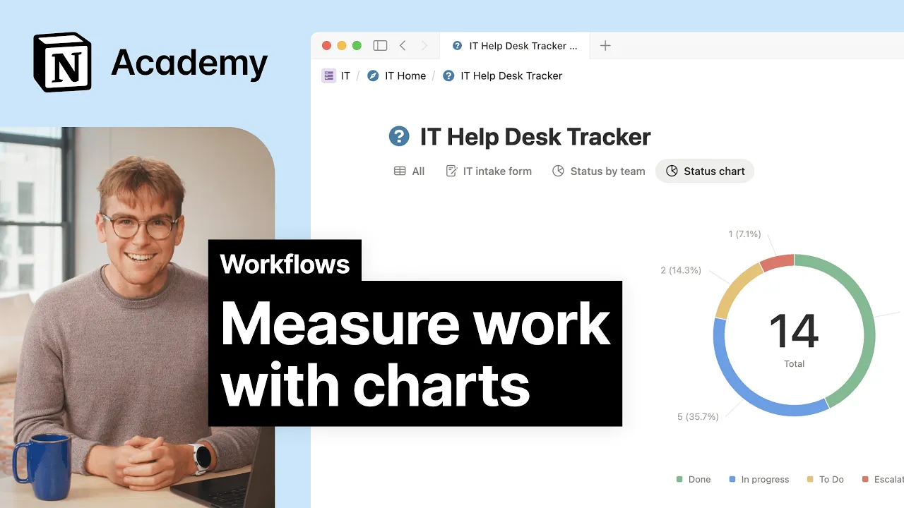

# Measure work with charts

**URL:** [https://www.youtube.com/watch?v=ssJa9fIRtnU](https://www.youtube.com/watch?v=ssJa9fIRtnU)
**Date:** 2025-09-18

## Transcript

**[Voiceover]**

"[Music] If you've got a database, especially one connected to a form, you'll probably want a way to visualize the data coming in. Take your team's IT help desk for example. Requests are rolling in. Your team is hard at work resolving them, but you might want to step back and tackle bigger questions like, are urgent issues getting squashed fast"

"enough? Which teams are logging the most tickets? And do we need more hands or just fewer broken printers? Sometimes the best way to understand your work is to visualize it. Let's bring the data in our IT help desk to life with charts. To get started, add a new view to your database and select chart. You'll get a whole"

"buffet of chart options like pi, bar, line, and more. Here are some useful ones. Use a bar chart to see the number of issues by status so you can quickly tell what's open, in progress, or resolved. Try a pie chart to break things down by priority. Go with a line chart to track issues opened versus closed over time."

"Charts in Notion are fully live and interactive. The data in your chart is tied to properties in your database. You can view data by team, system, or date range, and they'll automatically update to reflect the changes in your database. When you click on a chart element, like a bar, slice, or dot, you'll get a detailed view of the"

"database entries that make up that part of the chart. For example, if you have a chart showing task status, clicking on in progress will show you all the tasks currently underway. If you're looking at project completion by team, just click on a team members bar to see all the individual projects they're working on. It's an easy way to"

"go from the big picture to the nitty-gritty without switching views. You can also embed charts on a team homepage or stand-up doc to keep everyone aligned with the latest numbers. No exporting or manual updates needed. They can even become part of a team dashboard or report. So the data your team needs is always in view and always up"

"to date. The more you track, the more important it becomes to see the bigger picture. Charts in Notion turn raw data into something your team can act on so you can spot trends faster, make decisions with clarity, and keep improving how you work. [Music]"

