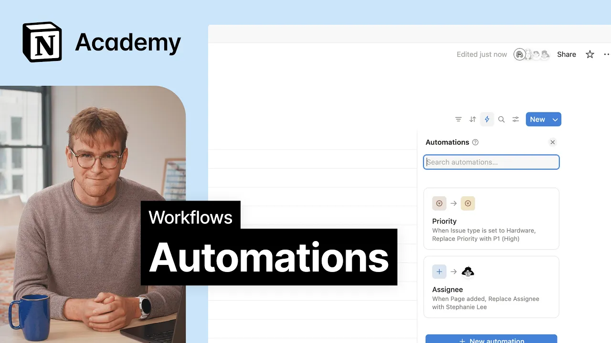

# Automations

**URL:** [https://www.youtube.com/watch?v=55zNDdiEZRg](https://www.youtube.com/watch?v=55zNDdiEZRg)
**Date:** 2025-09-18

## Transcript

**[Voiceover]**

"[Music] Let's talk about automations. The secret to making your database feel less like a spreadsheet and more like a teammate. At their core, automations follow a simple format. A trigger and an action. In other words, if this happens, then do that. Let's walk through some useful examples that'll save your team time and maybe some sanity, too. We'll use"

"an IT help desk to show you how this all works. First up, automatic assignment. Set the automation to trigger when a new page is added and add an action that assigns it to a teammate, maybe whoever's on call during that particular week. It's a simple way to keep requests moving without having to manually triage. Some requests are just"

"more urgent, like when a laptop dies in the middle of a meeting. Here we'll set an automation that looks for issue type is hardware and automatically set the priority to high. That way critical issues bubble up without your team needing to play guess the severity. Last one. Loop in your team at the right moment. When priority is set"

"to urgent, you can trigger a Slack notification. either to a shared channel or directly to the person so no one misses a high priority request sitting in the queue. You can even bundle rules together. For example, when a form submission lands in your database, you can automatically assign properties, move it to a specific view, or even trigger advanced"

"automations like running formulas or kicking off web hook actions. Each automation is configurable and can be paused if needed. With automations, you're no longer stuck sorting through requests or assigning tickets manually. Once everything is up and running, your team can focus more on solving real issues and less on managing the workflow around them. [Music]"

