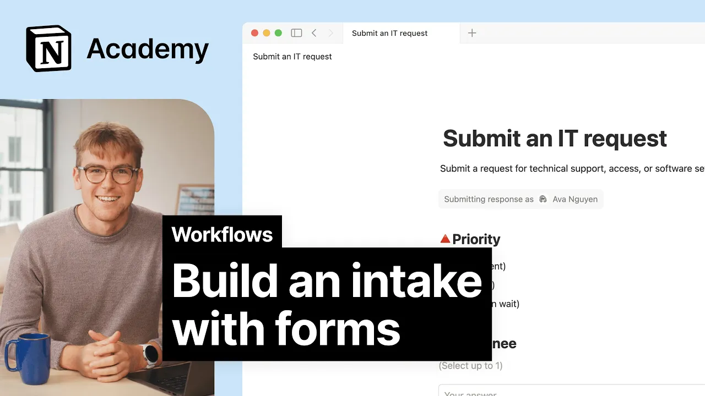

# Build an intake with forms

**URL:** [https://www.youtube.com/watch?v=O8O8eGl0nNs](https://www.youtube.com/watch?v=O8O8eGl0nNs)
**Date:** 2025-09-18

## Transcript

**[Voiceover]**

"[Music] When it comes to handling requests of any kind, structure is everything. Take your company's IT help desk for example. Whether it's a password reset, a broken monitor, or a classic it works yesterday, I swear moment, you need a clear, consistent way to collect it all. That's where forms come in. They make it easy for teammates to submit"

"requests and even easier for your team to track, triage, and respond without things slipping through the cracks or Slack. You've got two ways to get started. Type /form to build one from scratch. Or if you already have a database where you manage your work, you can turn it into a form with just a few clicks. We'll go with"

"the second option since most teams already have a system in place and just need a cleaner way to collect requests. Let's say you've got a full page database called it help desk where you've been logging issues manually. Just open the database and switch the view to form. Notion will automatically turn your properties into form fields. So if your"

"database already has fields like request type, priority, description, etc., you'll see all of those show up in the form ready to go. You can reorder fields, rename them, hide internal only stuff like status, and add helper text to guide the person filling it out. Now, let's make the form a little smarter with conditional logic. Let's say you have"

"a drop down for what type of issue are you facing with options like access issue, hardware, and software. You can show follow-up questions based on what the respondents pick. If they choose access issue, your form can show which system are you trying to access. Or if they choose hardware, show what type of hardware with options like laptop, monitor,"

"or inevitably printer. This keeps the form short, relevant, and helpful, so your team gets the info they need without the usual back and forth. Let's talk sharing. You have control over who can submit the form. Keep it open for ease of access or restrict it to Workspace members if the information is sensitive. You can even allow anonymous responses,"

"which is great for feedback where people might hesitate to attach their name. And finally, you can control who sees the submissions. In this case, it might make sense to keep the database private to your team, so requests stay organized and you're not fielding them in real time with everyone watching. Every form submission becomes a new entry in your"

"notion database, and that's where the real efficiency kicks in. Each answer maps directly to a property. Title drops into the title field. Description into a text column. Priority into a select property. No copying, no pasting, no give me 5 minutes to clean this up. It's all there structured from the start. You can even create multiple forms that all"

"lead to the same database. Think of it like different doors to the same house. If it handles both tech issues and equipment requests, you don't need to squeeze everything into a single form. You can just create two. You can customize each form to show only the relevant fields. As long as the property exists in the database, everything flows"

"into the same central tracker. From there, you can filter, sort, assign, and even trigger automations to keep things flowing. And because everything's in a database, you unlock dashboards, charts, and reporting, too. Turning a simple intake form into a system that scales without becoming a mess of spreadsheets. Bottom line, forms help your team stay focused. Surface what's urgent and"

"move fast on the work that matters most without getting buried in the noise. [Music]"

