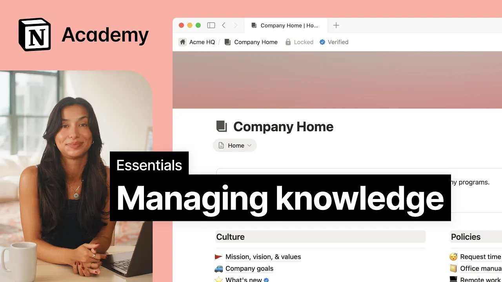

# Managing knowledge

**URL:** [https://www.youtube.com/watch?v=Qqb7Q8qPLeE](https://www.youtube.com/watch?v=Qqb7Q8qPLeE)
**Date:** 2025-09-18

## Transcript

**[Voiceover]**

"[Music] A knowledge base is a centralized place where teams can easily find trusted information. Without one, teammates wonder if certain documents are up to date and spend more time on tracking down information rather than the actual job to be done. When teammates know exactly what information to trust, you create a culture of clarity that eliminates confusion. Knowledge bases"

"help with this. Whether it's for onboarding guides, product documentation, or in this case, a place for companywide information and policies, Notion gives you flexible ways to turn your team's knowledge into a reliable source of truth. While any page or database can be used to store and share information, a wiki is a purpose-built option designed to help teams organize"

"and maintain knowledge at scale. Let's take a look. Here we have a company home with various pages about the company policies and programs. This is an example where the reliability of this information matters and it's used by various teams across the whole company. But this brings up an important question. How do we know this information is up to"

"date? Without knowing whether these pages were last reviewed 2 years ago or yesterday, the team is left guessing whether this information is still valid when they need it today. Notion has a way to turn any knowledge base like this one into a wiki. From the page settings, you'll find the option to convert a page into a wiki. This"

"gives every subpage new properties, including an owner and verification status to make sure there is both accountability and content accuracy. For example, on this mission, vision, and values page, you'll see it now has these properties: owner, verification, tags, and last edited time. The owner property makes it clear who's responsible for maintaining the information and the verification property gives"

"a review cadence. After selecting a verification time frame, pages get a blue check mark to visually reinforce this status and page owners will be notified when it's time to revisit. Not only does this help page owners, but it also communicates to anyone viewing the page that its information can be trusted. When you mark a page as verified, it"

"becomes more visible in search and notion AI responses, helping your team find trusted resources fast. The tag property lets us label similar pages, which is helpful for filtering and grouping. Tags might help us differentiate pages by type of document like company policies or highlight a curated set of important pages with a tag like top picks. Wikis come with"

"three default views. Home, all pages, and pages I own. The home view is the primary place for your audience to find the information they need. Here, we can use blocks to reinforce important information and make it more easily readable. For example, we might use callouts to explain what kind of pages the wiki contains or headings to organize similar"

"pages. It's also a great place to feature a selection of pages in the form of a database. Here, I'll add a new database with a gallery view of our pages labeled as top picks. So this information is front and center. All pages and pages I own are helpful for page owners because these views give an overview of pages"

"in the wiki as a table. These make it easy to review and change page properties in bulk. [Music] A well-maintained knowledge base makes search very powerful. Notion AI doesn't simply find relevant pages but actually delivers the answers to your questions. When we ask Notion AI for a specific detail like our company's vacation policy, we get back the exact"

"information with a reference to relevant pages. When you mark a page as verified, it becomes more visible in search and notion AI responses. Altogether, page ownership and verification combined with search is a powerful system to help anyone find accurate information fast. A knowledge base isn't just about storing information. It's about creating a system where finding, trusting, and using"

"that information becomes second nature to your team. [Music]"

