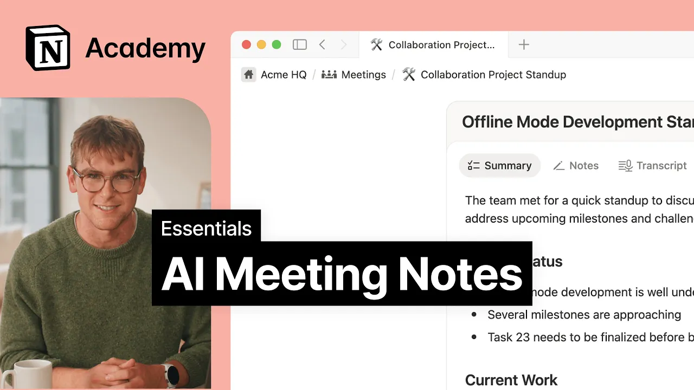

# AI Meeting Notes

**URL:** [https://www.youtube.com/watch?v=kXPLgh-TLnE](https://www.youtube.com/watch?v=kXPLgh-TLnE)
**Date:** 2025-09-18

## Transcript

**[Voiceover]**

"[Music] AI Meeting Notes is your personal notetaker. Just type /me to transcribe every detail of your meeting right in your notion workspace. When your meeting is over, all meeting notes and transcripts are fully searchable by notion AI, making it easy to find and reference important details after the meeting. Let's see AI meeting notes in action with an example,"

"a team standup. AI meeting notes, just like any other block, is accessible from the slash menu. Just type /me to create a new AI meeting notes block. For our standup today, let's add a simple agenda with placeholders for progress, blockers, and action items. We'll send the agenda to the team so they can add their updates before the meeting"

"begins. After getting consent from all participants, we can then start the recording. AI meeting notes transcribes your conversation using your mic and computer audio directly. This means it works well for both inerson or remote meetings with video conferencing tools like Zoom, Google Meet or Teams, for example. While AI meeting notes is recording, you can focus on the conversation"

"knowing that AI is keeping track of every insight, action item, and decision that gets made. For any other notes, the notes tab is always available to you and will be incorporated into your meeting summary afterwards. Here, it's helpful to make use of the atmention to link relevant pages or people. For example, you could link a product road map"

"or a teammate you'd like to follow up with afterwards. From the AI meeting note settings, we can define the meeting format or language if needed. This changes the meeting notes summary into a format best suited for the meeting at hand. In this case, our standup. When you stop the recording, AI meeting notes gives a summary of key points,"

"any manual notes, and a full transcript you can reference later. From here, you can even ask Notion AI to help draft a follow-up message in your preferred style. AI meeting notes is just one piece of an effective system to manage meetings on your team. Using a meetings database is a great way to keep everything in one place so"

"every discussion, decision, and next step is easy to find. Here are some ways to get the most from your meeting notes database. First, use properties to make meetings easier to filter and work with. These can include the meeting date, attendees, team, and meeting type. Next, create filtered views of the database, such as by team. This makes it easy"

"for anyone to find relevant meetings and return to past action items. Lastly, use database templates for recurring meetings to streamline note-taking. When a meeting takes place in the same format week after week, you can save yourself time by prepopulating a page with a database template. In this case, let's create our new AI meeting notes block, add our structure,"

"and link relevant pages. With this template all ready to go, all that's left is to create a new page, and jump straight into the meeting. Consider making a template for each meeting type to save time and keep your team's notes consistent. To automate this workflow even further, we can use repeating database templates to actually create a new page"

"for us. Once you've selected your frequency, a new meeting will automatically appear in the database at the scheduled time. And that's it. With AI meeting notes, everything from your agenda to meeting follow-ups is brought into one place. No more switching between tools or losing important details. Just focus on the conversation while Notion AI captures the rest. [Music]"

