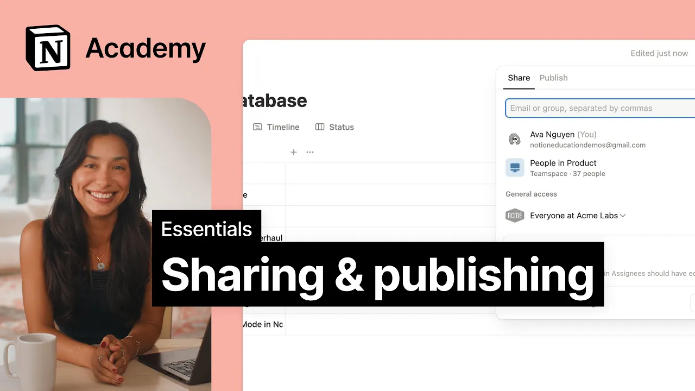

# Sharing & publishing

**URL:** [https://www.youtube.com/watch?v=mvaNaZ4-E4c](https://www.youtube.com/watch?v=mvaNaZ4-E4c)
**Date:** 2025-09-18

## Transcript

**[Voiceover]**

"[Music] As you build more pages in Notion, you'll want to share them. Sometimes you'll want to keep pages private, like meeting notes with your manager. Other times, you'll want to publish a page to the web for everyone to see, like a job post. Notion's permissions are very flexible to let you customize exactly how you collaborate with others. Whether"

"you're sharing with teammates, external guests like clients, or publishing content for the public, let's cover how to make sure everyone has the access they need. [Music] The share menu is your place for all things sharing and access control. Here, your own access is shown as well as the access permissions of other individuals, teams, and your organization as a"

"whole. Notion allows you to specify how you want to collaborate with others. From allowing anyone in the workspace to edit a page to restricting to view only access to just a few select team members. The general access section allows you to manage visibility settings more broadly. Whether it's restricting the page to only invited people or making the page"

"available to anyone with the link, even if they aren't in your workspace. The copy link button gives a sharable link to your page. This link follows the permissions that have been set here on the page. So only people with access will be able to open it. Beyond these databases allow you to set who can or who can't see"

"or edit certain pages. Whether it's to delegate, keep information private, or prevent accidental changes by non-team members. [Music] Now, let's go over a common scenario. Sharing a page with another person. Let's assume you have a one-on-one meeting notes database you'd like to share with your manager. This is a case where the page might contain sensitive information you don't"

"want everyone to see. From the share menu, we can type our manager's name, set access permissions, and send the invitation. If this page was private before, it will now show up in the shared sidebar section. Other times, we may need to share content with users outside of our workspace, like contractors, agencies, or clients. While members of your workspace"

"can collaborate on any content they have access to, you can also share specific pages with people outside your company by inviting them as guests. To share a page with a guest, use their email to invite them. Keep in mind that when you share a page, recipients also get access to any pages nested inside it unless otherwise specified. While"

"members of your workspace can freely browse and join team spaces, guests remain limited to exactly what's been shared with them. Now, for sharing a page more broadly with your entire team or company, we've already covered one way you can share to a team using the share menu. Here, you can give access to a team or the whole workspace."

"Beyond this, you can also share any page by dragging the page from your sidebar directly into the relevant teamspace section. Each team space comes with default permissions that control how members can interact with its pages. These settings will automatically apply to any new page you drag into the team space, making it easy to share a page with a"

"whole team at once. Anytime you create a page within a team space, database, or simply a shared page, that page will automatically inherit the permissions of its parent. To unlink those inherited permissions, you'll need to make changes directly in the subpage. Sometimes you'll want to share information with people who aren't in your workspace at all, like potential customers,"

"or the general public. Notion sites makes it easy to publish any page as a live website. Examples might include a help center, job board, or community program, but the possibilities are endless. From the share menu, use the publish tab to publish your page as a site. This includes any subpages and database content within that page. Your site goes"

"live instantly and stays synced with your page as you make changes. From your site settings, you can further customize your site to really make it your own. You can add a custom domain, search indexing, and a variety of other customizations. These include changing your site theme, favicon, header, and adding Google Analytics to track your site's performance. These publishing"

"features make site creation simple. Just update your page from your notion and boom, your changes are live as well. No extra tools or coding experience needed. Just publish your site directly from the same place you already work. Let's recap. The share menu is a place for sharing and access controls. Whether it's with your team, company, or the web,"

"sharing in Notion isn't simply about visibility, but giving everyone the information they need to work together effectively. [Music]"

