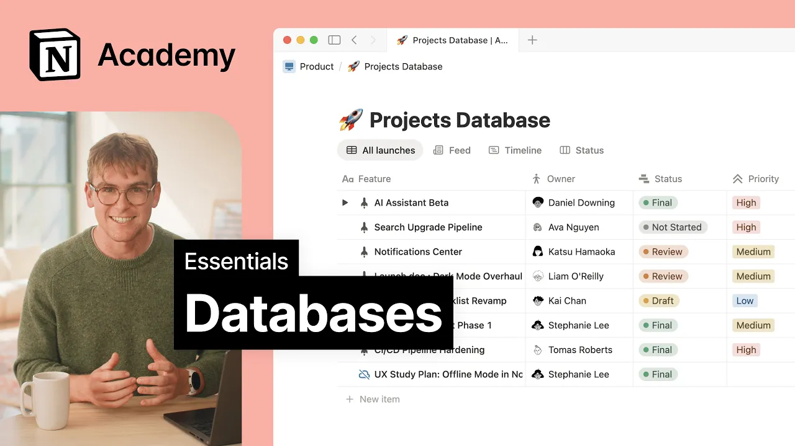

# Databases

**URL:** [https://www.youtube.com/watch?v=Nx114VWepoI](https://www.youtube.com/watch?v=Nx114VWepoI)
**Date:** 2025-09-18

## Transcript

**[Voiceover]**

"[Music] When teams rely on different apps for to-do lists, project planning, and docs, it's hard to keep a reliable source of truth. Countless Vfinals, and where's the latest messages often feel disorganized and inefficient. That's where databases come in. Databases in Notion are collections of pages with flexible ways to filter and visualize the information inside. When used effectively, databases"

"change how teams work by connecting things in ways that separate apps never could. Let's start with the basics. While rows may appear to be simple line items, you can open them to find a blank page to work with using Notion's wide range of blocks. In the case of this content calendar, you'll see that this page contains a content"

"overview and a draft of the blog post itself. On the outside, your database is clean and structured, but dig into any page, and you'll find it full of detailed content and information. All Notion databases have properties that add more information to the database and each of its pages in the form of text, people, dates, statuses, and so much"

"more. Properties can be added and customized to reflect the information you want to show in your database. Let's walk through our example. First is the name property, which is the only page required in a database. Given that every row is also a page, this name is also the page title. Next, we have a few other types of properties."

"We have a person property called writer, a date property called publish date, and a status property. Let's say we want to add a property that shows the type of content we're creating. We can choose the multi select property to create our own relevant tags. Properties apply to every row and page in the database. When we open a page"

"within the database, we'll see the complete list of properties. Properties are important because they allow us to create different views of the same database information. And that's where the power of databases comes in. With views, you can visualize the same database information in different ways with filters, sorts, and grouping options. Database views include calendars, boards, timelines, charts, feeds,"

"and more. In this case, let's see how this table looks when viewed as a calendar by deadline. This calendar view contains all the same pages that we have in the table, but now visualized by their deadline. By clicking a page, we access the same page information just like we did from the table. When a database property is changed,"

"it will automatically update across all views. For example, by moving a deadline on the calendar, this new deadline will be reflected in the table as well. Now, let's visualize our database as a board to more clearly see the work in progress. This is just one example of the many ways views let us visualize the same information. But what"

"if we only want to view database items that have a specific property? That's where filters come in. In this database, we might want to filter only by published content so that we can return to it easily. Here, let's create a new filter, select the status property, and filter by content published. Now we can save this as a new"

"database view for the team to return to. While this is only just one example, it shows how filters are used to make databases more customized and actionable. Now for creating new database pages, the simplest way to add a page is with the new button, but databases are often filled with similar types of pages and content. To make this"

"easy, database templates lets you replicate page content in new pages. Not only does this save time, but it ensures consistency across the team's work. For our content calendar, let's create a simple template for a new blog post with a content overview and the blog post itself. When we create our next post, we can get started faster from the"

"template. Now that we know how databases work, there's a few more considerations to keep in mind when building one. When you create a new database, you'll start by typing / database on any Notion page, and you'll see two options, inline and full page. These both do the same thing behind the scenes, but how they show up in your"

"workspace, that's what makes all the difference. An inline database is a database inside of a regular page, right alongside your text, checklists, images, and whatever else you've got going on. This works well when your database is just one part of a larger doc. You can also open inline databases as full page databases if you need to. A full"

"page database is exactly what it sounds like. It is the page just like our content calendar example. If you're working with lots of entries or switching between multiple views of the same information, this is usually the way to go. Databases also don't need to be built from scratch. Notion AI is another tool to quickly create new databases. First,"

"describe what you need in simple and specific terms, and notion AI will suggest the properties, views, and example pages. Everything is fully built for you and ready to use. Imports lets teams bring existing content into a notion database by uploading files or importing directly from tools like Confluence, ASA, and many others. This lets you continue your work right"

"where you left off. Lastly, use the templates marketplace to find inspiration and duplicate databases created by the community right into your own workspace. Make any adjustments you need and then you're ready to go. To recap, databases are collections of pages and properties. You can create them from scratch, add filters, and make database templates for consistency. They are an"

"essential part of any Notion workspace, a flexible tool to create tailored solutions for whatever the task may be. [Music]"

