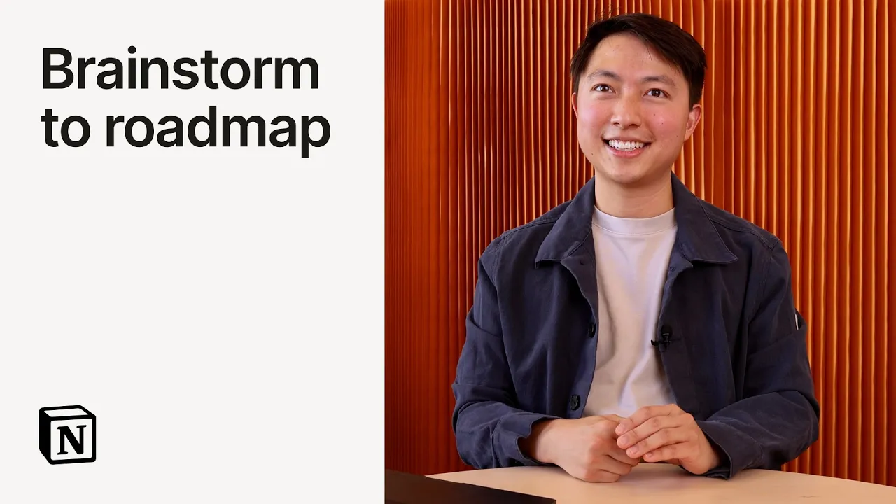

# Go from brainstorm to roadmap with Notion Agent

**URL:** [https://www.youtube.com/watch?v=xhSJMWUmrF0](https://www.youtube.com/watch?v=xhSJMWUmrF0)
**Date:** 2025-09-18

## Transcript

**[Voiceover]**

"Hey, I'm Eric. I want to show you how I use Notion AI to take ideas on a whiteboard and turn it into a product road map in just a few minutes. So, here I'm asking Notion AI to turn these sticky notes from our brainstorm into a road map database. And I wanted to group by similar ideas and also"

"prioritize by importance. So, let's go for it. What I did here is I just took a screenshot from our Fig Jam and threw it into this page. And what's cool is that Notion AI can read all the context of the page and view anything on it. So you can see it create a database and it's adding a bunch"

"of properties that are useful for road mapping like prioritization and effort and now it's actually populating the whole database with all the sticky notes. Before this is something that would have taken me forever manually copy and pasting all the text from each sticky note. It can also create views like this one by status so it's easy for us"

"to track our progress. What I love about this is I can take a messy screenshot and turn it into something that I can share with my team really easily. I found this super helpful and I hope you do too. [Music]"

