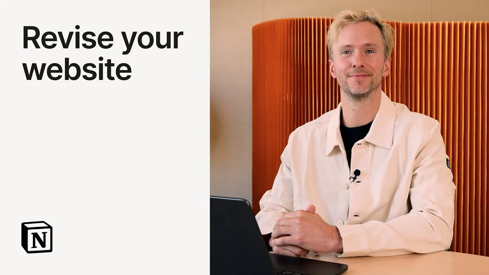

# Revise your website with Notion Agent

**URL:** [https://www.youtube.com/watch?v=bgzFclqj8Yw](https://www.youtube.com/watch?v=bgzFclqj8Yw)
**Date:** 2025-09-18

## Transcript

**[Voiceover]**

"Hi, I'm Hurley and I'm going to show you how I use the notion agent to save a bunch of hours on giving website feedback. Okay, here's what I asked. Critique this landing page and suggest improvements. Refer to our voice guide and messaging goals for 2025. Then create a reddrafted version that incorporates your feedback and uses notion blocks to"

"show the layout. I hit go. You can see it's processing. You can see the page that's actually analyzing which I uploaded. It's now searching across my workspace. You can see it's looking across the web as well. It looked across Slack. So, it's taking into consideration all this context, things like our voice guide, our messaging goals. Looks like it's"

"updating the page. So, you see that actually building out here. This is the critique telling me what's working, the gaps, and now it looks like it's starting to create the reddrafted version of this page. Okay, here it comes. So, it's using all the different notion building blocks to basically reddraft this entire page, incorporating all the feedback that it"

"gave above. This is great because now I can easily share this with my team. We can live edit this thing and really get it into production pretty quickly. Why this gets me so excited is not about this one page. It's about the scale that this really unlocks and being able to see what agent can do. Like we could"

"audit our entire website in an afternoon. So I hope you find use cases just like this that help you move a lot faster."

