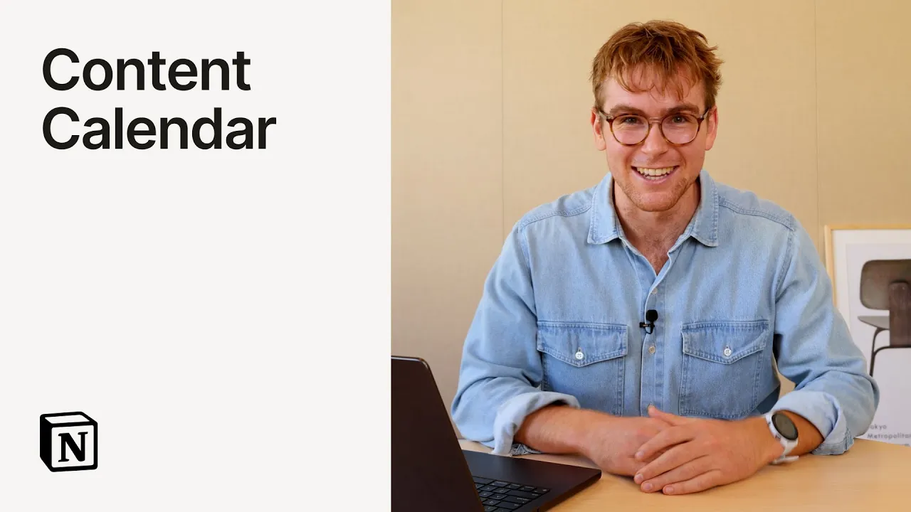

# Turn meetings into social posts with Notion Agent

**URL:** [https://www.youtube.com/watch?v=1NgA3YB6qAk](https://www.youtube.com/watch?v=1NgA3YB6qAk)
**Date:** 2025-09-18

## Transcript

**[Voiceover]**

"Here's the prompt. Can you help me turn this meeting into social posts on our calendar? Use our style guidelines. And then I'm going to mention the style guidelines and click go. Basically what I'm asking notion AI to do here is to apply a new releases brainstorming meeting which was taken with AI meeting notes and apply everything that we"

"talked about in this brainstorming session and to create them already as posts on the content calendar and notion AI not only can it search your workspace and has access to Slack and all these things but it can actually do things in notion on your behalf right and create things create pages just like your team would. So here you"

"can see here it's creating pages. It's adding them to this content calendar. And if I look at the calendar view, you can see it just added this one here. Let's open them up and see what's happening in there. So here's what it built. It took the core message from each of these feature launches and then created these drafts"

"of copy in our style. All of this ready to work from and gotten together so much faster than I could have done it myself. [Music]"

