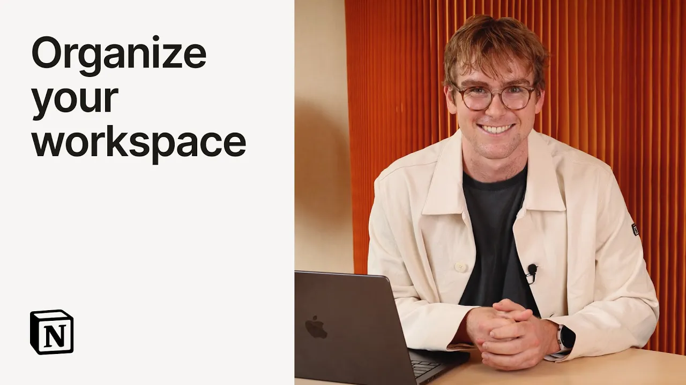

# Organize your workspace with Notion Agent

**URL:** [https://www.youtube.com/watch?v=CvaFkC9KN60](https://www.youtube.com/watch?v=CvaFkC9KN60)
**Date:** 2025-09-18

## Transcript

**[Voiceover]**

"Today I want to show you how you can go from a notion page that looks like this one to a well organized database like the one you see here. All with the help of Notion AI. This is really common when you're getting started in notion to have just a page of pages. But Notion AI can actually clean this"

"up for you really quickly. So let me show you how. Here I ask Notion AI turn these pages into an inline database that organizes them by company, product area, date, and anything else that makes sense. And then I click go. So here notion AI gets to work and the first thing we see is it actually creates an inline"

"database on this page. Now it's adding some properties and we see it start to build some views as well. And here we go. Now we see these pages start to stream in. So you can see it has company, product area, date and type. And what's cool here is it's actually pulling that information from those pages themselves. Now let's"

"check out some of these views here. First we see by product area. We have general, know your customer, mobile onboarding. Okay, this looks good. Calendar shows us the date that these meetings happened. And lastly, we have by company. This looks helpful as well. What I think special here is that Notion AI is now like a power user of"

"Notion. It can build for you and help keep your workspace organized. I hope you find this super helpful on your team and I'm so excited for you to try it."

