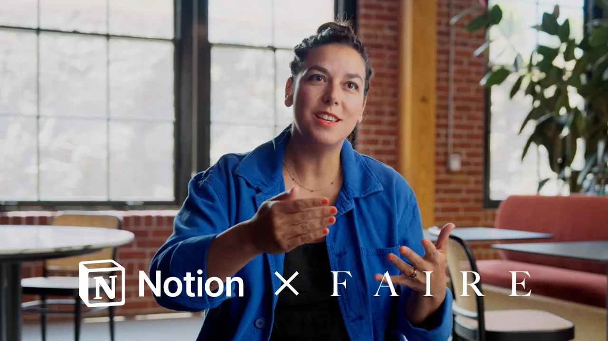

# How Faire connects work with Notion AI so agents can deliver

**URL:** [https://www.youtube.com/watch?v=j5UwVEQGooo](https://www.youtube.com/watch?v=j5UwVEQGooo)
**Date:** 2025-09-23

## Transcript

**[Voiceover]**

"There are some tools where I feel visceral pain when I have to open them up and use them. That is never the case with notion. &gt;&gt; I think the tools that you choose for your team are a direct extension of their day-to-day. Spend so much of their time in them. If it makes them happy, it makes them happy."

"But if it makes them frustrated, that's a direct correlation of what you value as an organization. We are serving retailers and makers who are creatives themselves and we're so inspired by them and it's why we do the work that we do. So notion as a tool itself embracing the same principles that we use as a design is an"

"incredible canvas for us to do that. Prior to notion AI we had a pain point which is like where is this document? Notion allows people to very quickly cut through the noise. So instead of having to go look through Google Docs and Slack to find a piece of information from 12 or 18 months ago, you can just go"

"to one place and it'll turn up the context that you need. This is our workspace for essentially everything. We have like 7 years worth of content in Notion. &gt;&gt; I used it the other day and it pulled something up from like 2019 and I was like, "Wow, I would not have found that myself." Thanks for having like an"

"amazing memory. &gt;&gt; You can essentially do everything. You can use notion AI rather than going to chat GBT feeding it a huge prompt with all this context about fair and just use notion AI to not only create and document things but find insights, metrics, best practices across the company, connect the dots between different teams. Agents will just further"

"evolve notion to be like the one stop tool. It's not this co-orker that's coming in this year and trying to figure everything out. It's a co-orker that's been around that really knows and has genuine context for why we've made certain decisions. If you plug that into an agent, you're going to get a really good experience. One of the"

"things as you scale as an org is what is everybody working on, how is it all related to each other, and how can we better bring those things together so we understand what are we doing as a company as a whole instead of what is my team doing here? And notion is kind of the hub that brings all"

"of those pieces together. sort of helps compress the upfront part of the product development process where teams are sort of in the understand phase. &gt;&gt; Road maps tend to go stale like the week after you create them. And so if you put them in notion, it's a lot easier for them to stay up to date and it's a"

"lot easier for people to find. &gt;&gt; When we start a project in that road map, a PRD is created in a database which is then linked to the teams. So everything is really interconnected and everything is central and all searchable. Having everything in one place just makes it easier for the teams that you support to actually do their"

"job effectively. The fact that we're able to free up a bunch of time for people to really spend on the deeper thinking that they need to do to build products for our customers is pretty rewarding. We're all in. We're all bought in. It's another arm of fair. It has been such a part of the way that we work"

"over time. It has grown with us. It has evolved with us that we've built a relationship with this tool and the way that we work in it. And how much time are you spending searching for information? How much time are you spending updating everyone on your team? If you're spending more than an hour on that a week, then"

"that's time you could get back. [Music] [Applause]"

