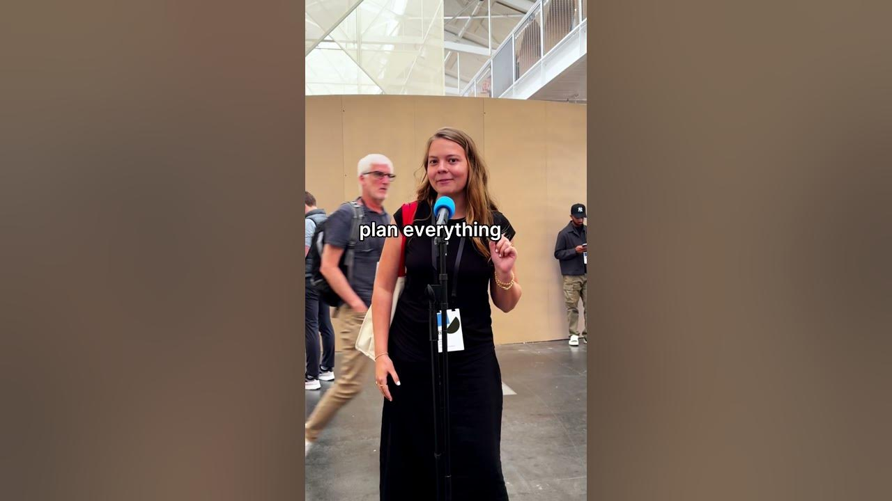

# What's your work secret?

**URL:** [https://www.youtube.com/watch?v=5fG1R2lGXlk](https://www.youtube.com/watch?v=5fG1R2lGXlk)
**Date:** 2025-09-23

## Transcript

**[Voiceover]**

"[Applause] My work secret is &gt;&gt; not actually focusing during focus time. &gt;&gt; A lot of coffee. I'm holding a coffee, but um Celsius, Celsius, Celsius. &gt;&gt; Plan everything the night before. So, I would not go on a date unless someone sends me a notion itinerary. &gt;&gt; Wait, seriously? &gt;&gt; Seriously. &gt;&gt; Seriously. And people have actually done it and"

"it was actually one of the best dates because they made a notion &gt;&gt; itinerary. [Music] not on the roster. &gt;&gt; I tell people I have meetings till noon every single day and I'm fully booked mostly to avoid having an alarm clock."

