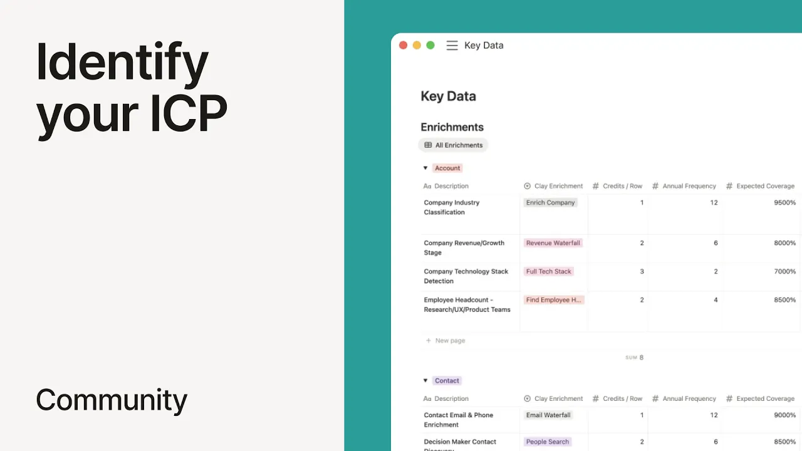

# Identify your ICP from meeting notes with Notion Agent (Matthew Silberman)

**URL:** [https://www.youtube.com/watch?v=4AOs5ZIJHZY](https://www.youtube.com/watch?v=4AOs5ZIJHZY)
**Date:** 2025-09-26

## Transcript

**[Voiceover]**

"Hey, I'm Matthew Silverman based in Brooklyn. I'm a Notion ambassador and I also co-lead Clay Club New York and this notion AI use case is one where those two worlds collide and I'm really excited about it. So these days I run a clay consultancy and one of the first things that I have to do for any new client"

"is figure out who they sell to in terms of what companies and what kinds of people at those companies. And sometimes my clients don't even know super clearly how to find those companies at scale. They don't necessarily know how to turn the image that they have in their mind about the types of companies that are a good fit"

"into a discrete set of data points that we want to go collect on a large scale so that we can be sure we're reaching out to the right people when we're trying to sell a given product. Ordinarily for me that takes a lot of work, a lot of thinking, a lot of time to have meetings with every member"

"of my client's team, understand that image they have in their mind and then translate that into those data points. But notion AI makes all of that a lot easier. So what we have here in this template is this is a portal that I've created for all of my clients. It's loaded up with all the onboarding tasks that I"

"need to go through with them. Um, and you can see here the very first thing is setting up conversations with the team. And then I'm at the step of analyzing transcripts, mapping the ICP, ideal customer profile definition to data points in Clay so that I know exactly what I need to build. And within this template, I have a"

"meeting notes database where I'm keeping track of all the discussions I'm having with the team. Um, and then here's where it gets really interesting with Notion AI. So, I wrote this prompt which explains I'm kicking kicking off with a nuclear client. The first thing I need to do is understand who the company sells to. And in order to"

"do that, I need notion AI's help to do two things. analyze all the meeting transcripts that I have and then use the output, use that analysis to fill out these databases where I'm keeping track of all the data points that I want to gather for companies and people that they sell to. So, why don't we go ahead and"

"run this prompt using the meeting notes and this page with the database that I want to fill out. And you can see this will start to run. It'll analyze those meeting transcripts, figure out, okay, the people that I was speaking with, what do they mention we should know about companies in order to determine if they're the right companies"

"to go after. So, we're seeing those characteristics come out here, and now it's getting to work populating these databases. Awesome. This is this is super exciting to watch because otherwise it's just me manually updating all of this and as you can imagine that's a lot more painful and complicated and slow. It's also really cool to see the types"

"of analysis that notion AI makes um pulling out things from those meetings that I didn't necessarily notice myself and that are actually really good points in terms of various data points I could gather to make sure that we're identifying the right companies and people to sell to. So, this is just a brief taste of a notion AI use"

"case that I've built that definitely helps me save a lot of time when I'm on boarding new clients and definitely blows my clients away in terms of reflecting back to them. Here's who you sell to, how you can find those people at scale, how you can increase your sales pipeline using this combination of notion and clay. So, thanks"

"so much for watching and I hope you found this helpful."

