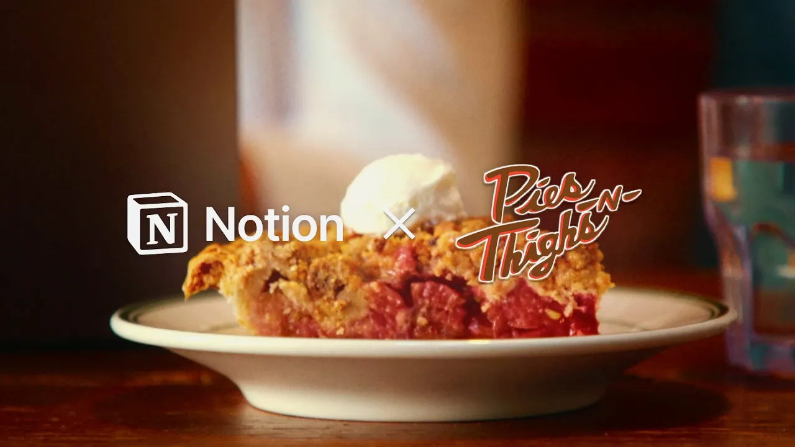

# Notion x Pies 'n Thighs

**URL:** [https://www.youtube.com/watch?v=0yK5yAkEjZ0](https://www.youtube.com/watch?v=0yK5yAkEjZ0)
**Date:** 2025-09-30

## Transcript

**[Voiceover]**

"So, Pies and Thighs opened in 2006. We make everything in house. We think we make the best homemade comfort food in New York. We are opening our second location early next year. And as we've tried to sort of formalize things and make things a little bit easier for training, for hanging on to recipes or ideas, trying to have"

"it all in one place is really important to us. The modern restaurant landscape is not as modern as people would think. And the way information has been organized, if it has been organized, can be anything from written on a napkin, someone just remembers it because they've worked here 8 years and like I don't know until I taste it."

"&gt;&gt; Jason and I have very different work styles. He is very processoriented. He's incredibly organized. I am a little bit more all over the place. The recipes right now are held in many places. Our system before notion was not great. &gt;&gt; That's true of not only the recipes, that can be true of financial statements, team member records, all"

"those like administrative and compliance pieces. My goal is to help modernize in a way that allows them to focus on what they do best. Notion seemed to be the best suited for us. I have started to use the AI features with notion for analysis. I upload the statements from Door Dash, Uber Eatats, and GrubHub. I run it through"

"a filter to show me topline sales, marketing impact, promo impact, and then ultimately net payout. And then I compare them to each other. 6 minutes later, I'm looking at a really informed graph, chart, however I want to visualize that information. That would have taken me before notion 6 8 hours. From there I can make an informed decision on"

"things that might need to be adjusted. So you're getting all of the information into a single source dashboard that is massively powerful. [Music]"

