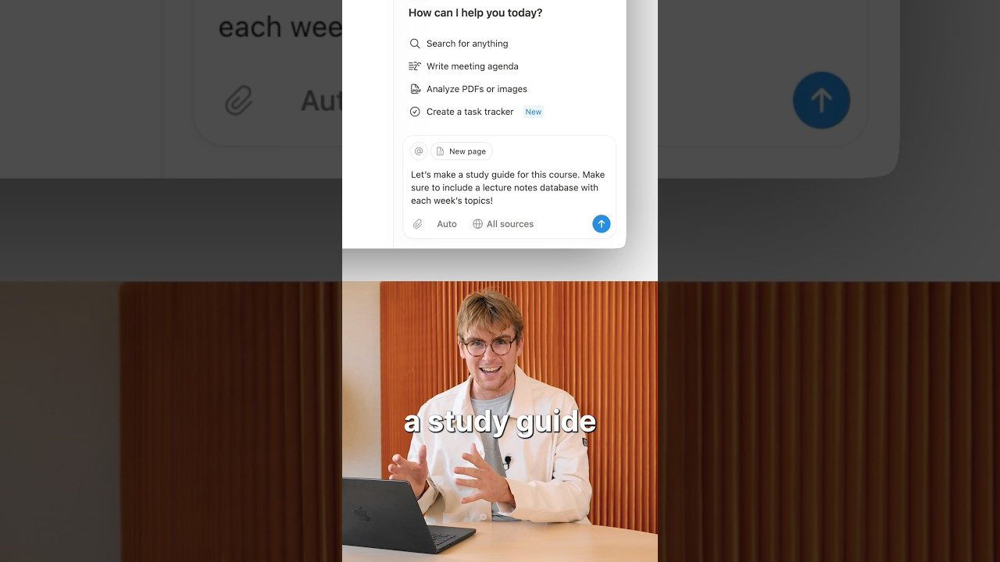

# Turn Your Syllabus Into A Study Guide With Notion Agent #study #backtoschool

**URL:** [https://www.youtube.com/watch?v=zUHtuGPHbRI](https://www.youtube.com/watch?v=zUHtuGPHbRI)
**Date:** 2025-10-03

## Transcript

**[Voiceover]**

"Let's use Notion AI to build a study guide for a university course. Here's the prompt. Let's make a study guide for this course. Make sure to include a lecture notes database with each week's topics. And then I'm going to upload the syllabus as well. Let's click go. So now Notion AI is getting to work. So it's taking all"

"the context from that syllabus and this prompt and then building this out for us. So we have an overview, expectations, academic honesty, lecture schedule. This is looking pretty good. Deadlines at a glance. And this is where things are going to get interesting here as it builds out this database. Okay, this is great. So now it's adding these pages"

"here. We can see them streaming in. And at the top, we start to see some views as well. This study guide looks good and ready for some notes. As each lecture comes along, I could open each page and start to take my lecture notes. And if I wanted to share them with a friend, for example, I could go"

"and share from up here. And what's great is that Notion AI is also in the sidebar, which means that I can ask it any questions about difficult topics that come up as I'm taking notes. Before, this is the type of thing that would have taken all day to build and customize like we have here. But now, in just"

"a few minutes, we have something that we can already work with. So, hope you find this super helpful for your next course. [Music]"

