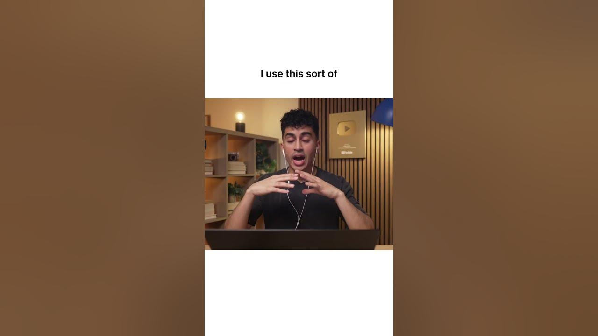

# How do you lock in?

**URL:** [https://www.youtube.com/watch?v=Hax3tWGi1us](https://www.youtube.com/watch?v=Hax3tWGi1us)
**Date:** 2025-10-30

## Transcript

**[Voiceover]**

"How do I stop procrastinating? Okay, I think it really starts at the environment first and foremost. Create a space where you can genuinely lock in and focus for at least 30 minutes on whatever task you have at hand. Visualization helps a lot. Just imagine how you're going to feel if you finish the task in time and then also"

"visualize the opposite scenario. And I genuinely think notion is one of the best tools that you can use to organize. I use it sort of as like a central OS for everything in my life truthfully. So this right here is how notion works. You have pages where you can add tables, to-do list, checkpoints, whatever it is you need."

"The great thing about notion is that they have templates. So this right here is a class notes organizer and the beautiful part is notion provides this by default. Over here we also have a student planner. Here you can organize everything related to your courses, your assignments and even your extracurriculars. With notion you have the ability to have this"

"one global view of all of your priorities. Such a flexible space where you can use it to optimize almost [music] every aspect of your academic career."

