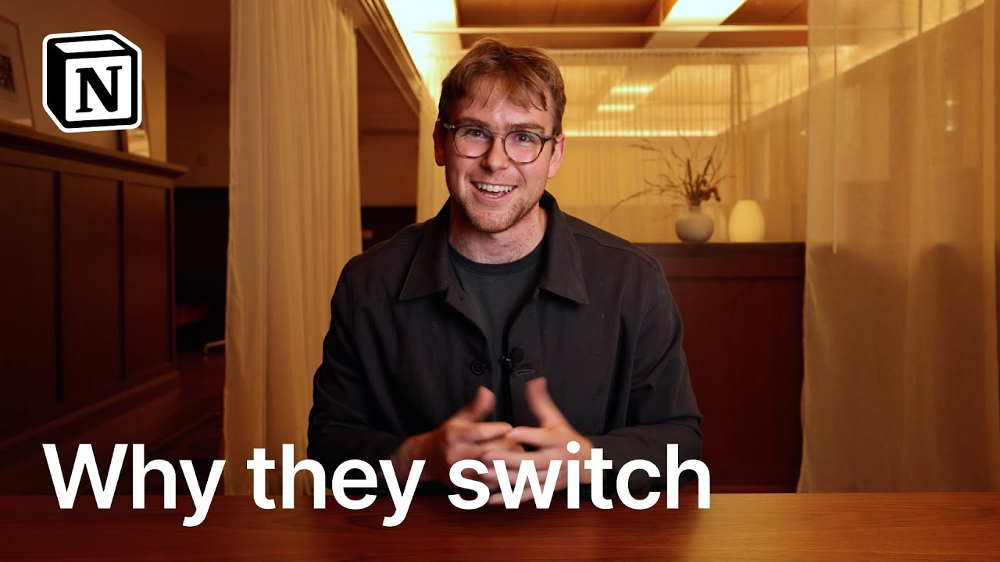

# Why Teams Switch From Legacy Wikis to Notion

**URL:** [https://www.youtube.com/watch?v=xm-RiXrJ4Hw](https://www.youtube.com/watch?v=xm-RiXrJ4Hw)
**Date:** 2025-12-02

## Transcript

**[Voiceover]**

"A lot of people ask why Notion is different than a lot of other tools out there in the market. Earlier this year, Lenny's newsletter interviewed 6,500 tech professionals and found that Notion was the most switched to tool from the likes of Jira and Confluence. That's because unlike rigid or narrow knowledge management tools, Notion is an AI workspace where"

"teams capture knowledge, search to find answers, and automate workflows in one place. This is why so many of the world's fastest growing companies like OpenAI, Cursor, and Ramp rely on Notion, and use it to move even [music] faster. Let me show you what I mean. First off, it's the best place to capture all your team's [music] knowledge. Now,"

"of course, Notion is great for docs, but it's also where teams record their meetings, manage [music] projects, and get more done with AI agents. Let's take a look at AI meeting notes. When you use Notion AI to record your meetings, you get a clean summary with next actions after every call. With Notion Agent, you can then easily update"

"your project tracker to reflect what was [music] decided, all in the same place where work is already happening. Another reason teams prefer Notion is that it's actually the place you can find answers you need. Ask any question and Notion AI will search across all connected sources [music] to find the right answer, including tools like Slack, Google Drive, GitHub,"

"and many more. Lastly, teams prefer Notion because it's where they can automate their busy work with AI agents. Everyone is asking how to make the most of AI today, but often AI is lacking the right context to actually be helpful. Notion agents combine the right context with the latest models to handle repetitive tasks so you can focus on"

"more strategic work. This could look like Notion AI filing bugs as they're reported across your team, aggregating different project statuses into a report, or [music] in this case, answering questions people ask on Slack. At the end of the day, high performing teams choose tools they love, not complain about. Get in touch and let us show you a workspace"

"that increases productivity, reduces cost, and that your teams [music] will love as well."

