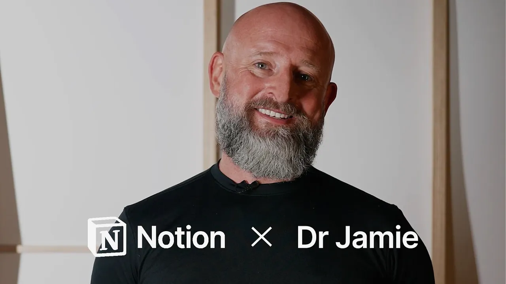

# Dr Jamie Phillips shares how clear clinical governance enables health innovation

**URL:** [https://www.youtube.com/watch?v=MODyHQtzHLo](https://www.youtube.com/watch?v=MODyHQtzHLo)
**Date:** 2026-01-04

## Transcript

**[Voiceover]**

"[music] I'm Dr. Jamie Phillips. I'm a specialist rural and remote physician with advanced specialist training in emergency medicine. I served for nearly 20 years in the UK armed [music] forces and then the Australian Army as a commando medical officer and then as an Australian army officer. I've previously been chief medical officer at Sa and chief medical officer at"

"UPDoc. Knowledge sharing is central to what I do. It's about building relationships [music] and that's where knowledge kicks in. Knowledge sharing is all about building relationships. If you're not willing to share knowledge freely and without transaction cost, you'll never build [music] faithful relationships. So big fan of using clinical governance on notion. So clinical governance is typically [music] a"

"a handbreak to growth and development and innovation. Whereas by putting clinical governance framework and and making it a living document that's accessible, particularly using the AI feature, it's democratized [music] access to it. It's democratized access to my brain and it also supercharges growth. [music] The AI assistant is a godsend for me. It scales my brain. What it helps"

"me to do is work smarter and more importantly helps me offload a lot of the busy tasks that I have to during the day [music] so I can do the things that I love. The meaningful work which is actually changing lives and removing access blocks for care. So yeah, 100% for me it's the AI assistance. &gt;&gt; What would"

"you tell someone who is [music] deciding between notion and another platform? Oh, &gt;&gt; that's JFD. Just do it. [music] &gt;&gt; [music]"

