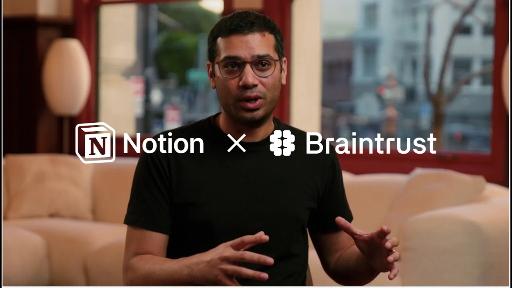

# How Braintrust Refuses Repetitive Work with Custom Agents

**URL:** [https://www.youtube.com/watch?v=Vt1Pjeob7LY](https://www.youtube.com/watch?v=Vt1Pjeob7LY)
**Date:** 2026-02-24

## Transcript

**[Voiceover]**

"In the age of AI, you should just refuse to do repetitive work. &gt;&gt; At the beginning stages of building agents in notion, we were thinking about what are the most annoying tasks that we're doing and find a way to automate those. I've got my customer evidence buddy, my competitive intelligence buddy, my usagebased buddy, and many more helping me"

"behind the scenes. The first was a competitive analysis agent. We have it looking at our competitor change logs, listening to the gong transcripts, and then we're using that to update our one-pagers in notion. It triggers every morning at 9:00 a.m. We have another agent that's super helpful. It listens to our self-s served customers and their usage and then"

"helps to surface the accounts that are most likely to convert and upgrade to enterprise for our sales team. Notion AI has become my primary entry point to what's happening in the organization. So if I want to ask questions about what's happening on Slack, for example, or I want to understand the latest status of a customer or an engineering"

"project, I just open notion AI and then I ask. &gt;&gt; You can quickly realize that we're saving, you know, hours a day with not having to do all of this additional research and having the the insights served up to us. The benefit of, you know, eliminating busy work is not just that it makes you more productive, but it"

"actually allows you to build and provide a much better product and service to the people that you work with."

