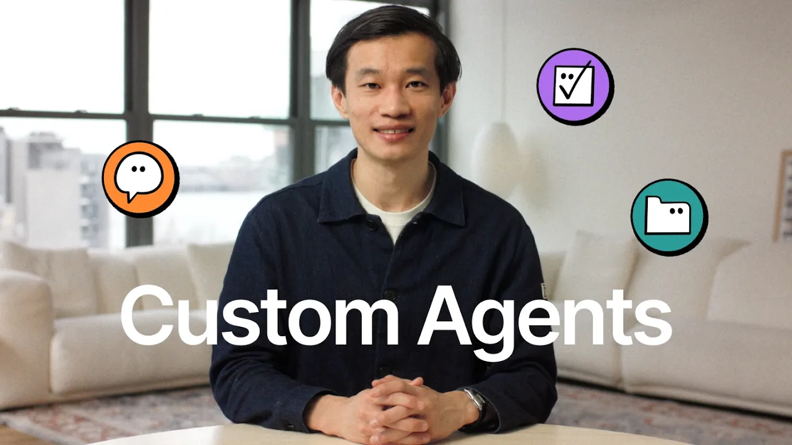

# Custom Agents are here! (CEO Message)

**URL:** [https://www.youtube.com/watch?v=aZSx8JNAA10](https://www.youtube.com/watch?v=aZSx8JNAA10)
**Date:** 2026-02-24

## Transcript

**[Voiceover]**

"Ivan custom agents take one, mark. Hey everyone, Ivan from Notion here. Today is an important day in Notion history. We're launching customer agents. They are the collaborative, multiplayer AI agents that work for your whole company autonomously, 24/7. In the past few months, the market has filled up with all kinds of agent tools, and they're impressive, but most of"

"them are single player that runs on your local PCs or Mac mini. One person set them up, one person benefit. At Notion, we believe the real value of AI lies in helping businesses and teams, not just for engineers or AI hobbyists. AI agents should live in the cloud, take a minute to set up, no coding required. Most importantly,"

"AI agents should be collaborative. When one person builds something useful, the whole company should benefit. That's why we build custom agents. They work with all your essential business tools out of the box like Slack, email, and calendar, and collaborate with other agents like Cursor and Claude Code. And they support all the latest language models, usually the same day"

"when those models are released, so you never have to worry about a model lock-in. Early testers at companies like Ramp, Vercel, and Cursor have put 25,000 custom agents to work just in the past few months. And their agents are doing real work, like answering product questions, triaging HR requests, and resolving IT tickets, saving those companies thousands of hours"

"of busy work each week. More than anything though, I'm proud that we built custom agent to bring AI agent to every business. You shouldn't need an AI engineering team to benefit from AI. Any team, any size can put Notion custom agent to work because we want to make sure that no company gets left behind in this AI era."

"Notion custom agents are available today and we're looking forward to see what they unlock for your business."

