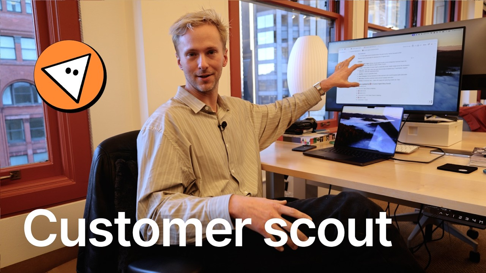

# This Custom Agent Finds Your Best Customers (while you sleep)

**URL:** [https://www.youtube.com/watch?v=6H4X8NuPFqo](https://www.youtube.com/watch?v=6H4X8NuPFqo)
**Date:** 2026-02-24

## Transcript

**[Voiceover]**

"I'm Hurley. I lead product marketing here. Uh we are [music] getting ready for the custom agent launch and I'm going to show you how I built a custom [music] agent to help us find our top customers that we could do stories with who are using custom agents. Uh I'll quickly show you, you know, this project. This is a"

"project page. We're staying organized here. Um, there's lots of data sources linked here like databases for early access customers and dashboards and all this stuff, but ultimately my goal is to figure out who are the customers that we should be pursuing for stories. Um, and so I actually have this custom agent who is dropping in these uh reports"

"every few days on which customers that we should go target. One thing I will mention uh because I think it's important how it works is that I did start by writing out criteria of the types of companies that I want to get stories from. Basically like the top of the top customers, they have great usage, their healthy accounts,"

"all of that stuff. The agent ends up reading these criteria when it suggests which customers to to actually suggest. So let me pop over to the agent here. uh my custom agent story scout and I'll show you the settings. Uh one thing to note in this is that um I didn't actually set up all of these triggers, instructions,"

"and tools on my own. Um what I actually ended up doing to build this was I just ended up talking to Notion and telling it what I wanted and it ended up actually building the entire agent for me. That's a demo for another time. But what does this agent actually do? You can see every Monday, Wednesday, Friday at"

"9:00 a.m. it runs and it creates that report back in that page. Uh these are my instructions for the agent. You can see it looks across lots of different data sources. Uh bunch of databases, other pages. I'll show you in a second all the Slack channels it ends up reading. uh talked about some of the ranking criteria. So"

"this is basically it looking for which customers I think would or it thinks would be great uh candidates for the stories uh ranking behavior and then actually instructions for how it writes the report. Um, so that's where you see things like create new toggle in this page and that's where it knows actually to drop in the toggle into"

"the page where in the page even down to like how to format each update. So every update looks pretty similar. Those are the main kind of instructions that you kind of need to know. Finally, you have this tools and access section which shows you the things in notion that it has access to. You can see it has access"

"to view the early access customers and actually has access to edit that page that we've asked it to write the reports into and then a bunch of Slack channels that it has access to. I think this is this is like a pretty specific example. Um but at the end of the day like can be generalized to a lot"

"of different things. Maybe you're looking for not just like customer stories, but like what accounts should we be going after? You know, their upsell deals, upgrade deals, churn risks, like anything like that of monitoring usage across a bunch of disparate data sources and then writing a report. Um, you could kind of think of like, I don't know, a"

"dozen different examples where this type of thing would be pretty useful. That's my custom agent."

