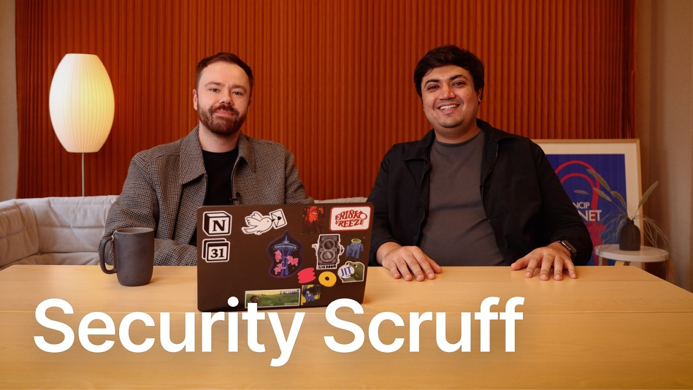

# Meet Scruff, Security's New AI Teammate (Custom Agent)

**URL:** [https://www.youtube.com/watch?v=4G6_lUcNsMs](https://www.youtube.com/watch?v=4G6_lUcNsMs)
**Date:** 2026-02-24

## Transcript

**[Voiceover]**

"As a security person, I'm inherently skeptical of new ways of solving these problems. But I remember that one time where you like finally connected up the external MCP servers and it looked at all of our security tools and it corresponded to Slack and it looked up everything in notion and found like a message from somebody saying they were"

"about to do something and I was like, "Oh." Hey, I'm Britain. I'm on the detection and response team at Notion. I'm here with Nishell and we're going to talk today about the custom agent that we built for security work called Scruff. &gt;&gt; Hey, I'm Nishell. I'm a security engineer here at Notion. &gt;&gt; For context, a detection and response"

"team gets a ton of alerts. We're a small team, but we've got to respond to really serious threats super fast and we've got a lot of tools to help us do that job. And the goal of Scruff is to help make that a little bit easier to bounce between all those tools and get really really good investigation results."

"&gt;&gt; Yeah. Let's just like get into the weeds of this and like can you walk us through like an alert and you know Scruff triaging triaging an alert? &gt;&gt; Sure. Yeah. Um I think a good one to show is so here we've got Scruff's homepage of the custom agent. You can see I can interact with Scruff, ask it"

"follow-up questions, but you can see in the recent activity you've got a series of runs at different times when a new page was created in the alerts database. So whenever a security alert comes in, it's just an Ocean page. So, we have Scruff react when that page gets created and it will begin its triage process. Let's go and"

"check out one of those alerts that I think is a really good example of why Scruff has been valuable for my team. So, that alert would be the AWS IM identity center manual modifications. I know very catchy name for this alert. Uh, this alert has some key information that I would know as a responder what it means and"

"and how to react to it. I've got the event name, how severe it is, roughly what happened, who did it, and where it came from, and then I've got a linked runbook. So, every time I get one of these alerts, I'm going to go and look at that runbook to go and determine what do I need to do"

"to investigate this. What do I need to do if this is legitimate and I need to respond to this and this is like a real problem. Scruff has all that same context. Scruff is going to go look at that alert. Scruff is going to look at the runbook that our team wrote by hand top to bottom and it's"

"going to go and run an investigation to help make that triage process a little bit easier. We're really adamant on notion security that an agent is never supposed to make the final decision of whether or not this is a true positive or a false positive. That's the job of a detection response engineer, somebody on the security team to"

"like really really determine this is legitimate. We need to go. We need to deal with this. So what Scruff's role is, if you consider that, is what is evidence pointing towards concern? What is evidence pointing towards legitimacy? What questions can I equip the responder with to maybe stimulate a little bit of creativity of where should I go next"

"to determine whether this is something of of concern. So if we go and check out what Scruff did with this information, you can see you've got that same alert summary. You saw it in the alert page before. Scrolling down, you can see an event timeline. Roughly when this started, it went and looked at Slack. You can see no"

"pre-announced change documentation found in Slack search. That's really helpful. And there's kind of a fun thing in there where Zach also has access to this page. There's it's kind of cute. Uh there's a spot where it says, "Zack is a confirmed security team member with established history of legitimate AM identity center administrative work." And Zach commented, "Honestly, what"

"a compliment. So, because it's an Ocean page, it's also like a collaborative spot where we're like, &gt;&gt; if you're on security, you also have access to that. &gt;&gt; So, can you show us the custom agent under the hood, how it works, how it got set up? &gt;&gt; Yeah, sure. So, super easy. Let's just pop into the settings tab"

"right here. You can see we've got a few different ways to trigger Scruff. You can do a new chat. You can do when a page is added, like we talked about before. That's the main one that we use is a new page will get created and it'll kick Scruff off and then kind of the real core of how"

"Scruff works. It's it's really not that complicated. There's just this instructions page which is just a notion page. It's got an initial setup that says what you are, what your identity is, what you're good at, and then some principles that we establish right up front of it being very evidence focused that it never makes true positive, false positive"

"determinations that it's always supposed to think critically, question assumptions, gather comprehensive context, stuff that I'm going to try to do when I triage an alert. I want it to kind of be approaching the response process the same way that we would on the on the Dart team. And then really critically, which I think was part of like the"

"aha moment that you and I had initially is Scruff is connected to all of these different tools and resources. So if I close this, I can scroll down here and you can see Scruff is connected to Slack. Scruff is connected to CrowdStrike, to whiz, to scanner. These are all the tools that I'm going to go look at when"

"I'm triaging alert and scruff can look at those as well. So it's really valuable to be able to go and search across everything. &gt;&gt; You mentioned something about a memory page. Can you can you describe more in detail what you meant by that? What what that is? &gt;&gt; Yeah, totally. So, every time Scruff runs, it's going to do"

"the whole triage process. We already talks about that. And then after it's going to kind of write like a little journal entry to itself, like, okay, I got this alert today. I had trouble when I tried to use this MCP and I actually after a couple iterations realized that this was the correct tool I should have called. And"

"it'll write that down on a page. Next time it runs, it's going to add a new memory. Next time it runs, it's going to add a new memory. So, as it's going, it's getting a little bit better at kind of dodging those little &gt;&gt; Yeah. It's learning from its previous mistakes. &gt;&gt; Mhm. Yeah. And it's learning in a"

"way that's crazy simple. I mean, let's just go look at it. So, &gt;&gt; if I pop into Scruff's memories &gt;&gt; and is this is Have you written any of these memories or these are all generated by Scruff itself? &gt;&gt; These are all generated by Scruff. And we're obviously going to redact the entirety of this page. But uh these"

"are these are all of the things that Scruff has been doing over the past I don't know week. &gt;&gt; Yeah, maybe we can pop one open. &gt;&gt; Yeah, we can pop one open and just have it covered in black bars. But uh I promise this is a memory. Um it's going to be a black bar, but at the"

"bottom it says tuning recommendations. This is I think the key that makes the difference and why the memory is valuable. It recommends that I add a suppression for this specific behavior or it recommends potentially doing dduplication of this alert type. It can also potentially write things like next time I investigate this alert, use this tool instead of this"

"tool from this MTP server. So next time it's not going to have as much of a tough time as it did the first. Getting better and better every time it runs. &gt;&gt; So what's your advice to anybody building Scruff for themselves? Honestly, it just start small. Like it doesn't have to solve every problem. If it just solves like"

"one tiny little thing that makes you a little bit more tired in the workday, that's helpful. If you have just good, clear instructions, you've got some simple runbooks for how you would resolve an alert and you've got some MCP servers that connect you to really good data, you're kind of set up for success. That's that's what I would"

"say. Start small."

