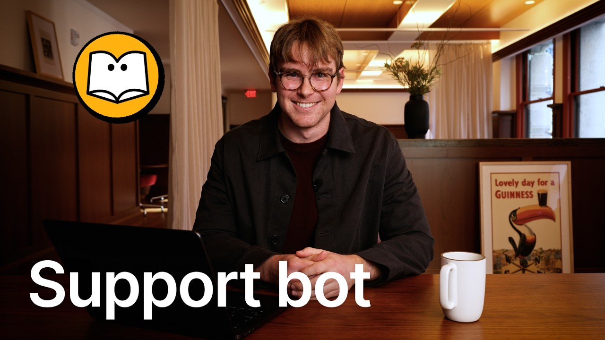

# Get Answers in Slack 24/7 with this Custom Agent

**URL:** [https://www.youtube.com/watch?v=obZiznCOQAA](https://www.youtube.com/watch?v=obZiznCOQAA)
**Date:** 2026-02-24

## Transcript

**[Voiceover]**

"So, our support team gets thousands of questions every week and now they save so much time with a custom agent that someone built in an afternoon. We call this our customer support bot. It lives in Slack and it answers questions using our [music] documentation. This has been a gamecher for the team because it helps them find answers to"

"difficult [music] questions and it also uses every question as an opportunity to make our documentation and knowledge base [music] even stronger. Okay, so here I am in Slack and I'm looking at a channel called customer support ask and this has been connected with our custom agent. So here I'm going to ask a question. I'm going to say question,"

"how do I store prior versions of a page? [music] This is a product question uh somewhere in our documentation. Now I'm going to click submit and it'll just uh take a second to then go now look through our knowledge and [music] find the right answer. And let's give it a second here. So after just a second we'll see"

"the custom agent has responded. I'm going to open up this thread here. Here you can see our customer support bot. It gives the answer to the question and then it gives a citation. In this case the page settings and then it gives a thumbs up or [music] a thumbs down to mark whether it was resolved. In this case"

"I'll give it a thumbs up because that looks good. And if I open up the page settings you'll see over here this is where we have information about the version history. Okay. So now let's pretend that we have a question that isn't in the documentation here. In this case, I'll say question um when is the next big user"

"conference. You can see that um the green check mark came to mark that this question was resolved. [snorts] Um I'm going to have our question here. When is the next big user conference? And here I'm going to click submit as well. And this is an example of a type of question that has no answer in the documentation. All"

"right. So we just got a reply there. Now I'm going to open it up. And here we see I couldn't find anything in our help center. I created a new knowledgebased update request to get this documented. And then if I open this up, you'll see what it's done is it [music] creates a new ticket. I'm just going to"

"open up this database so you see what it is. Next big user conference date. And if I open it up, it has information about this request. And then it also has a suggested title, suggested content, [music] and exactly how we might uh implement this change. So, at this point, we have a bit of an understanding of how this"

"custom agent works in Slack. Now, I want to go behind the scenes to show you how this [music] custom agent was built. So, here I'm going to open up this page over here. This is what a custom agent looks like and let me show you where it lives in the notion workspace here. Here under the agents sidebar section,"

"you'll see a place where [music] you could create any new agents and in this case where this agent lives. Now, to give you a bit of an overview about what's happening [music] here, at the top here, you see triggers. This is anything that should initiate the agent to do something. [music] In this case, when a message is sent"

"into a Slack channel or uh when any reaction is added. Down below, we see the instructions. So, this is the the brain [music] of the um agent, so it knows what to do. Um down below, we see uh tools and access. So, this is um uh pretty self-explanatory, but it's where the agent can [music] um view or edit"

"and create content. Um and lastly, down below, we see the model, and this is important because you can pick any of your preferred models um from the current leaders, and we continually will update [music] uh these as well. Now, let's focus on the instructions because that's where the majority of work is happening. And before I get into it"

"specifically, let me just note that as you create a new custom agent, the agent is going to help you create itself. And so, when you write your prompt, it'll actually build it out in a way that's similar to what we have here already out of the gate. So, don't worry about this looking uh too long or intimidating for"

"you to write manually. So, let's look high level what's happening here. At the top, we have an overview. This is the general uh responsibility of the customer support bot. We have the resources. So these are all the pages that it should um uh look into whether it's either finding an answer or creating a new request to update the"

"database. Um down below it's super prescriptive about what it should do when an answer is found or not found. Down below it gives more information about how it should handle um any reactions in Slack threads or when people post alternatively um in this [music] um in these channels. And lastly, we have style uh style and tone rules, which"

"this [music] is um of course more specifically about how it should respond. Um with that, that is everything that's essentially included. And I'll make sure we include a link uh so you could copy these exact rules um yourself if you'd like to. So, this was the customer support bot that our support team has really been finding valuable recently."

"But actually, this is just one example of a larger idea here. You can build a custom agent for any scenario where your team might be asking questions in Slack and there's answers somewhere in your documentation. This could look like a people team bot answering questions from [music] um things that come up in company policies or guidelines. It could"

"look like a sales team bot which could be helpful in looking into product details or pricing details. Also perhaps for a product manager maybe it could be a helper and help when there's information that can be found in different product specs or meeting notes or decision docs. And really the list goes on from there. So, with that, I'd"

"encourage you to get started creating your own custom agent. And if you have any feature recommendations, any feedback, any questions, we'd be happy to help and we'd love to hear. So, please let us know."

