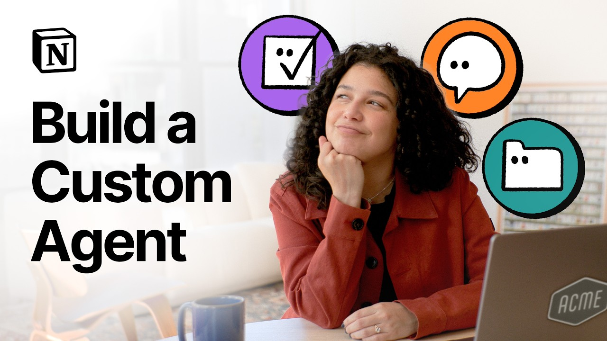

# How to build a Custom Agent

**URL:** [https://www.youtube.com/watch?v=ojAvnSdsc1I](https://www.youtube.com/watch?v=ojAvnSdsc1I)
**Date:** 2026-02-24

## Transcript

**[Voiceover]**

"I could reply to the same&nbsp; question in Slack every week… …or let a Custom Agent take it off my plate. I could manually sort and route incoming requests… …or let another agent organize the chaos for me. I could compile and send weekly reports myself… …or set up a Custom Agent once and&nbsp; relax while it runs in the background."

"With Notion, Custom Agents do the busy work so your time goes where it’s actually useful. Here’s how to build one. The first step is spotting the work&nbsp; that’s tedious and time-consuming. Think tasks that are routine,&nbsp; repetitive, or manual. The kind that are low impact, yet&nbsp; still eat up real time every week. Then ask yourself, “If I set this"

"up once,&nbsp; would my whole team benefit?” If you’re nodding along right now, you’ve&nbsp; got a solid case to build a Custom Agent. For me, this shows up in our team Slack. I manage our customer support&nbsp; team’s internal knowledge base, and every week, the same questions pop up. “Where do I log a billing-related issue?” “How do we handle this"

"edge case?” That’s exactly the kind of&nbsp; thing a Q&amp;A agent is good at. It answers those questions by pulling from&nbsp; our knowledge base so I don’t have to. To get started, head to the Agents section&nbsp; in your workspace sidebar and click here. You can build one from scratch, use a template,&nbsp;&nbsp; or start chatting with a Custom&nbsp; Agent about"

"what you need. For your first agent, I’d&nbsp; recommend that last option. Just explain what you’re trying to accomplish. That’s what I’ll do here. “Create a Q&amp;A agent for the #cx-team channel that&nbsp;&nbsp; answers questions by searching our help&nbsp; center and internal knowledge base.” Here you’ll see your&nbsp; conversation with a custom agent. And over here you’ll see how it&nbsp; fills"

"things in the instructions,&nbsp;&nbsp; triggers, and access to suggested pages. The nice thing about Custom Agents is&nbsp; you don’t have to spell out every step. You describe the outcome you want through&nbsp; chat and the agent works out how to get there. You can always review and tweak anything you&nbsp; need, but the heavy lifting is already done. As you chat"

"with a Custom Agent, you can&nbsp; follow along with what it’s building. We’ll start with triggers. Triggers tell your agent when to run. Some are event driven. They&nbsp; run when something happens,&nbsp;&nbsp; like a new Slack message or&nbsp; a page added to a database. Others are scheduled. They run automatically on&nbsp;&nbsp; a defined schedule every Monday&nbsp; morning or at the end"

"of the day. For our Q&amp;A agent, the moment&nbsp; is pretty straightforward:&nbsp;&nbsp; when someone wants an answer,&nbsp; they should be able to get one. In my example, the Custom Agent already&nbsp; set up two trigger options. When it’s @mentioned in Notion and when&nbsp; a message is sent in Slack. When you’re instructing&nbsp; your agent, clarity matters. Be clear about the goal"

"and&nbsp; the outcome you’re looking for. Think of your Custom Agent&nbsp; like a capable teammate: you give them the goal, then let them run with it. Start by showing what good looks like. You can cite or add specific examples&nbsp; your Custom Agent can learn from. Then point the agent to the right sources. This is where you can @mention specific"

"pages,&nbsp;&nbsp; people, or databases or drop in&nbsp; links you want it to reference. And finally, it helps to think in simple if&nbsp; then terms when chatting with your agent. This is how you guide the agent’s judgment. For example, you could say, “If the&nbsp; answer exists in the help center,&nbsp;&nbsp; then reply with a short summary&nbsp; and a link. If it"

"doesn’t,&nbsp;&nbsp; then say you don’t know and point&nbsp; the question to the right team.” And at any point, you can open the&nbsp; instructions page and tweak things directly. As you chat with your Custom Agent,&nbsp; it may populate pages, databases,&nbsp;&nbsp; or tools it needs in the tools and access section. If the Custom Agent works across external&nbsp; tools, you connect those"

"here, too. For our Q&amp;A agent, that’s usually the help center,&nbsp; knowledge base, or a small set of shared docs. The key thing to know, even if&nbsp; pages and tools are pre-populated, you should review and confirm your agent&nbsp; has the right permissions for each one. In most cases, view access is enough. Only give edit access when needed. Use the"

"drop down next to each&nbsp; tool to fine-tune permissions. With Slack, for example, you choose exactly which&nbsp; channels the agent can read from or post to. It won’t see private DMs, and it won’t&nbsp; respond in channels you haven’t configured. To do its job well, your agent may need access&nbsp; to information that isn’t meant for everyone. Before you roll it"

"out more widely,&nbsp; it’s worth doing a quick access check. Before you let your agent&nbsp; loose, take a minute to test it. Head to your Slack channel, post a&nbsp; question, then see how it responds. Does the tone feel right? Is it pulling from the right pages? In my case, the answers are solid, but I want&nbsp; them to sound a"

"little warmer and more friendly. So, I’ll jump back into chat&nbsp; and tell the agent exactly that. You can head to the instructions page and&nbsp; adjust a specific step that didn’t work. Maybe you add an example, clarify the&nbsp; format, or @mention a different page. As you iterate on your agents over time, it’s&nbsp; helpful to keep an eye on the"

"Activity tab. It shows each time the agent runs, what it&nbsp; did, and whether everything worked as expected. Custom Agents also support Version History, so you can experiment confidently&nbsp; and roll back changes if you need to. By default, your AI model is set to “auto,” which&nbsp; lets Notion pick the best model for each request. If you want a bit"

"more control, you&nbsp; can always choose a specific model. One last thing: this agent will run&nbsp; in Slack, but for some use cases, you may need to share it more broadly&nbsp; with your team using the Sharing panel. You can give teammates “can view and interact”&nbsp; permissions so they can chat with the agent… …or “can edit” and “full” permissions&nbsp; if"

"they need to update its settings. And that’s it. You’ve built your first Custom Agent. Over time, the agent takes care of the small,&nbsp;&nbsp; repetitive stuff so you can focus&nbsp; on the work that actually needs you."

